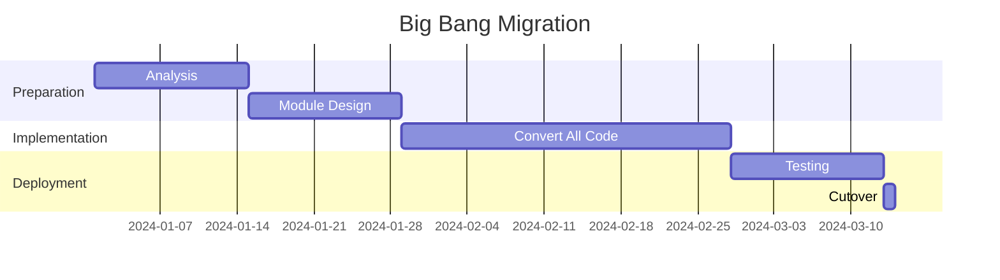

# CDMF Migration and Integration Guide

## Table of Contents
1. [Migration Overview](#migration-overview)
2. [Assessment Phase](#assessment-phase)
3. [Migration Strategies](#migration-strategies)
4. [Legacy System Integration](#legacy-system-integration)
5. [Incremental Migration](#incremental-migration)
6. [Data Migration](#data-migration)
7. [Testing During Migration](#testing-during-migration)
8. [Rollback Procedures](#rollback-procedures)
9. [Common Migration Patterns](#common-migration-patterns)
10. [Integration with External Systems](#integration-with-external-systems)
11. [Migration Tools](#migration-tools)
12. [Case Studies](#case-studies)

## Migration Overview

### Why Migrate to CDMF?

Organizations typically migrate to CDMF to address:

- **Monolithic complexity**: Unmaintainable large codebases
- **Deployment challenges**: Need for zero-downtime updates
- **Extensibility requirements**: Third-party plugin support
- **Scalability issues**: Need for modular scaling
- **Technical debt**: Accumulated architectural problems

### Migration Timeline

Typical migration timeline for different project sizes:

| Project Size | LOC | Team Size | Migration Time | Effort |
|-------------|-----|-----------|----------------|---------|
| Small | <50K | 2-5 devs | 1-3 months | 1 person-month |
| Medium | 50K-200K | 5-15 devs | 3-6 months | 3-6 person-months |
| Large | 200K-1M | 15-50 devs | 6-12 months | 10-20 person-months |
| Enterprise | >1M | 50+ devs | 12-24 months | 30+ person-months |

### Migration Phases

```
┌──────────────┐
│  Assessment  │ (2-4 weeks)
└──────┬───────┘
       │
┌──────▼───────┐
│   Planning   │ (2-4 weeks)
└──────┬───────┘
       │
┌──────▼───────┐
│    Pilot     │ (4-8 weeks)
└──────┬───────┘
       │
┌──────▼───────┐
│  Migration   │ (3-12 months)
└──────┬───────┘
       │
┌──────▼───────┐
│  Validation  │ (2-4 weeks)
└──────┬───────┘
       │
┌──────▼───────┐
│  Production  │
└──────────────┘
```

## Assessment Phase

### Codebase Analysis

#### Dependency Analysis Tool

```python
#!/usr/bin/env python3
# analyze_dependencies.py

import os
import re
from collections import defaultdict
import graphviz

class DependencyAnalyzer:
    def __init__(self, src_dir):
        self.src_dir = src_dir
        self.dependencies = defaultdict(set)

    def analyze(self):
        for root, dirs, files in os.walk(self.src_dir):
            for file in files:
                if file.endswith(('.cpp', '.h', '.hpp')):
                    self.analyze_file(os.path.join(root, file))

    def analyze_file(self, filepath):
        module = self.get_module_name(filepath)

        with open(filepath, 'r') as f:
            content = f.read()

        # Find includes
        includes = re.findall(r'#include\s+[<"](.+?)[>"]', content)
        for include in includes:
            dep_module = self.get_module_name(include)
            if dep_module != module:
                self.dependencies[module].add(dep_module)

    def get_module_name(self, path):
        # Extract module name from path
        parts = path.split('/')
        if 'src' in parts:
            idx = parts.index('src')
            if idx > 0:
                return parts[idx - 1]
        return parts[0] if parts else 'unknown'

    def generate_graph(self):
        dot = graphviz.Digraph(comment='Dependencies')

        for module, deps in self.dependencies.items():
            dot.node(module)
            for dep in deps:
                dot.edge(module, dep)

        dot.render('dependencies', format='png', cleanup=True)

    def find_circular_dependencies(self):
        # Detect circular dependencies
        circular = []
        for module in self.dependencies:
            if self.has_cycle(module, set(), []):
                circular.append(module)
        return circular

    def has_cycle(self, node, visited, path):
        visited.add(node)
        path.append(node)

        for neighbor in self.dependencies.get(node, []):
            if neighbor in path:
                return True
            if neighbor not in visited:
                if self.has_cycle(neighbor, visited, path):
                    return True

        path.remove(node)
        return False

# Usage
analyzer = DependencyAnalyzer('/path/to/source')
analyzer.analyze()
analyzer.generate_graph()
circular = analyzer.find_circular_dependencies()
print(f"Circular dependencies found in: {circular}")
```

#### Complexity Metrics

```bash
#!/bin/bash
# measure_complexity.sh

echo "=== Codebase Complexity Analysis ==="

# Lines of code
echo "Lines of Code:"
find . -name "*.cpp" -o -name "*.h" | xargs wc -l | tail -1

# File count
echo "Number of Files:"
find . -name "*.cpp" -o -name "*.h" | wc -l

# Class count
echo "Number of Classes:"
grep -r "^class " --include="*.h" | wc -l

# Function count
echo "Number of Functions:"
grep -r "^[[:space:]]*[[:alnum:]_]*[[:space:]]*(" --include="*.cpp" | wc -l

# Cyclomatic complexity (using lizard)
echo "Cyclomatic Complexity:"
lizard . --CCN 10

# Coupling metrics
echo "File Dependencies:"
for file in $(find . -name "*.cpp"); do
    includes=$(grep -c "^#include" $file)
    echo "$file: $includes includes"
done | sort -t: -k2 -rn | head -10
```

### Module Identification

#### Natural Module Boundaries

```cpp
// Identify modules by:
// 1. Directory structure
modules/
├── authentication/     // Clear module boundary
├── database/          // Another module
├── reporting/         // Another module
└── ui/               // Another module

// 2. Namespace organization
namespace auth { ... }      // Authentication module
namespace db { ... }        // Database module
namespace report { ... }    // Reporting module

// 3. Library boundaries
libauth.a       // Authentication module
libdatabase.a   // Database module
libreporting.a  // Reporting module
```

#### Module Extraction Criteria

```python
# module_identification.py

class ModuleIdentifier:
    def score_for_extraction(self, component):
        score = 0

        # High cohesion (good for module)
        if component.internal_calls > component.external_calls:
            score += 10

        # Low coupling (good for module)
        if component.external_deps < 5:
            score += 10

        # Clear interface
        if component.public_apis < 20:
            score += 5

        # Reasonable size
        if 1000 < component.loc < 50000:
            score += 5

        # Independent lifecycle
        if component.release_frequency != "with_main":
            score += 10

        return score

    def recommend_modules(self, components):
        recommendations = []
        for comp in components:
            score = self.score_for_extraction(comp)
            if score > 25:
                recommendations.append({
                    'name': comp.name,
                    'score': score,
                    'priority': 'high' if score > 35 else 'medium'
                })
        return sorted(recommendations, key=lambda x: x['score'], reverse=True)
```

### Risk Assessment

#### Risk Matrix

| Risk Factor | Impact | Likelihood | Mitigation |
|------------|---------|------------|------------|
| Breaking changes | High | Medium | Comprehensive testing, gradual rollout |
| Performance degradation | Medium | Low | Performance benchmarking, optimization |
| Integration failures | High | Medium | Integration testing, fallback mechanisms |
| Data loss | Critical | Low | Backup procedures, data validation |
| Downtime | High | Medium | Zero-downtime migration strategy |
| Team resistance | Medium | Medium | Training, clear benefits communication |

## Migration Strategies

### Strategy 1: Big Bang Migration

Convert entire system at once during a maintenance window.



**When to use:**
- Small to medium codebases (<100K LOC)
- Can tolerate downtime
- Simple architecture
- Small team

**Implementation:**
```bash
# 1. Stop old system
systemctl stop legacy-app

# 2. Deploy CDMF version
cp -r /staged/cdmf-app/* /opt/app/

# 3. Migrate data
./migrate-data.sh

# 4. Start new system
systemctl start cdmf-app

# 5. Verify
./verify-migration.sh
```

### Strategy 2: Strangler Fig Pattern

Gradually replace legacy system with CDMF modules.

```cpp
// Phase 1: Facade over legacy
class LegacyFacade : public IService {
    LegacySystem* legacy_;
public:
    Result process(Request req) override {
        return adaptResult(legacy_->oldProcess(adaptRequest(req)));
    }
};

// Phase 2: Partial migration
class HybridService : public IService {
    LegacySystem* legacy_;
    NewModule* new_;
public:
    Result process(Request req) override {
        if (shouldUseNew(req)) {
            return new_->process(req);
        }
        return adaptResult(legacy_->oldProcess(adaptRequest(req)));
    }
};

// Phase 3: Complete migration
class NewService : public IService {
    NewModule* new_;
public:
    Result process(Request req) override {
        return new_->process(req);
    }
};
```

### Strategy 3: Branch by Abstraction

Create abstraction layer, implement new version, then switch.

```cpp
// Step 1: Create abstraction
class IDataAccess {
public:
    virtual Data getData(const Key& key) = 0;
    virtual void putData(const Key& key, const Data& data) = 0;
};

// Step 2: Wrap legacy
class LegacyDataAccess : public IDataAccess {
    OldDatabase* old_;
public:
    Data getData(const Key& key) override {
        return old_->fetch(key.toString());
    }
};

// Step 3: Implement new version
class CDMFDataAccess : public IDataAccess {
    IDataService* service_;
public:
    Data getData(const Key& key) override {
        return service_->get(key);
    }
};

// Step 4: Switch implementation
class DataAccessFactory {
    static std::shared_ptr<IDataAccess> create() {
        if (useCDMF()) {
            return std::make_shared<CDMFDataAccess>();
        }
        return std::make_shared<LegacyDataAccess>();
    }
};
```

### Strategy 4: Parallel Run

Run both systems in parallel, gradually shift traffic.

```cpp
class ParallelRunner {
    LegacySystem* legacy_;
    CDMFSystem* cdmf_;
    double cdmfTrafficRatio_ = 0.0;

public:
    Response processRequest(const Request& req) {
        // Determine which system handles request
        if (shouldUseCDMF()) {
            auto response = cdmf_->process(req);

            // Shadow mode: also run on legacy for comparison
            if (inShadowMode()) {
                auto legacyResponse = legacy_->process(req);
                compareResponses(response, legacyResponse);
            }

            return response;
        }

        return legacy_->process(req);
    }

    bool shouldUseCDMF() {
        return (rand() / double(RAND_MAX)) < cdmfTrafficRatio_;
    }

    void increaseTraffic(double increment) {
        cdmfTrafficRatio_ = std::min(1.0, cdmfTrafficRatio_ + increment);
    }
};
```

## Legacy System Integration

### Wrapper Modules

Create CDMF modules that wrap legacy components:

```cpp
// LegacyWrapperModule.cpp
class LegacyWrapperModule : public cdmf::IModuleActivator {
private:
    cdmf::ServiceRegistration serviceReg_;
    std::shared_ptr<LegacyAdapter> adapter_;
    LegacySystem* legacySystem_;

public:
    void start(cdmf::IModuleContext* context) override {
        // Initialize legacy system
        legacySystem_ = LegacySystem::getInstance();
        legacySystem_->initialize();

        // Create adapter
        adapter_ = std::make_shared<LegacyAdapter>(legacySystem_);

        // Register as CDMF service
        serviceReg_ = context->registerService<IModernService>(
            "com.example.IModernService",
            adapter_
        );
    }

    void stop(cdmf::IModuleContext* context) override {
        legacySystem_->shutdown();
    }
};

class LegacyAdapter : public IModernService {
private:
    LegacySystem* legacy_;

public:
    explicit LegacyAdapter(LegacySystem* legacy) : legacy_(legacy) {}

    ModernResult process(const ModernRequest& req) override {
        // Convert modern request to legacy format
        LegacyRequest legacyReq = convertToLegacy(req);

        // Call legacy system
        LegacyResponse legacyResp = legacy_->processRequest(legacyReq);

        // Convert response to modern format
        return convertToModern(legacyResp);
    }

private:
    LegacyRequest convertToLegacy(const ModernRequest& req) {
        LegacyRequest legacy;
        legacy.setId(req.getId());
        legacy.setData(req.getData().c_str());
        return legacy;
    }

    ModernResult convertToModern(const LegacyResponse& resp) {
        ModernResult result;
        result.setStatus(resp.getCode() == 0 ? Status::SUCCESS : Status::ERROR);
        result.setData(resp.getMessage());
        return result;
    }
};
```

### Database Migration

#### Dual Write Pattern

```cpp
class DualWriteDataService : public IDataService {
private:
    LegacyDatabase* legacyDb_;
    ModernDatabase* modernDb_;
    std::atomic<bool> readFromModern_{false};

public:
    void write(const Key& key, const Value& value) override {
        // Write to both databases
        legacyDb_->put(key, value);
        modernDb_->insert(key, value);
    }

    Value read(const Key& key) override {
        if (readFromModern_) {
            // Read from new database
            auto value = modernDb_->get(key);

            // Verify consistency in background
            verifyConsistencyAsync(key, value);

            return value;
        } else {
            // Read from legacy database
            return legacyDb_->get(key);
        }
    }

    void switchToModern() {
        readFromModern_ = true;
    }

private:
    void verifyConsistencyAsync(const Key& key, const Value& modernValue) {
        std::thread([this, key, modernValue]() {
            auto legacyValue = legacyDb_->get(key);
            if (legacyValue != modernValue) {
                LOG_ERROR("Data inconsistency for key: " << key);
                // Handle inconsistency
            }
        }).detach();
    }
};
```

### API Bridge

Bridge between legacy APIs and CDMF services:

```cpp
// REST API to CDMF Service Bridge
class RestToCDMFBridge {
private:
    cdmf::IModuleContext* context_;
    httplib::Server server_;

public:
    void start() {
        // Legacy REST endpoint
        server_.Post("/api/v1/process", [this](const auto& req, auto& res) {
            // Parse legacy request
            auto legacyData = json::parse(req.body);

            // Get CDMF service
            auto service = context_->getService<IProcessingService>(
                "com.example.IProcessingService"
            );

            if (!service) {
                res.status = 503;
                res.set_content("Service unavailable", "text/plain");
                return;
            }

            // Convert and process
            ProcessRequest cdmfReq;
            cdmfReq.setData(legacyData["data"]);

            auto result = service->process(cdmfReq);

            // Convert response to legacy format
            json response = {
                {"status", result.getStatus()},
                {"result", result.getData()}
            };

            res.set_content(response.dump(), "application/json");
        });

        server_.listen("0.0.0.0", 8080);
    }
};
```

## Incremental Migration

### Module Extraction Process

#### Step 1: Identify Module Boundary

```cpp
// Before: Monolithic code
class MonolithicApp {
    void processOrder(Order order) {
        // Authentication
        if (!authenticateUser(order.userId)) {
            throw AuthException();
        }

        // Validation
        if (!validateOrder(order)) {
            throw ValidationException();
        }

        // Business logic
        calculatePricing(order);
        checkInventory(order);

        // Persistence
        saveToDatabase(order);

        // Notification
        sendNotification(order);
    }
};
```

#### Step 2: Extract Interface

```cpp
// Define module interfaces
class IAuthenticationService {
public:
    virtual bool authenticate(const UserId& userId) = 0;
};

class IOrderValidationService {
public:
    virtual bool validate(const Order& order) = 0;
};

class IPricingService {
public:
    virtual void calculatePricing(Order& order) = 0;
};
```

#### Step 3: Create Module Implementation

```cpp
// AuthenticationModule.cpp
class AuthenticationModule : public cdmf::IModuleActivator {
    class AuthService : public IAuthenticationService {
        bool authenticate(const UserId& userId) override {
            // Extracted authentication logic
            return performAuthentication(userId);
        }
    };

    void start(cdmf::IModuleContext* context) override {
        context->registerService<IAuthenticationService>(
            "com.example.IAuthenticationService",
            std::make_shared<AuthService>()
        );
    }
};
```

#### Step 4: Update Monolith

```cpp
// Modified monolithic code using CDMF services
class HybridApp {
    cdmf::IModuleContext* context_;

    void processOrder(Order order) {
        // Use CDMF authentication service
        auto authService = context_->getService<IAuthenticationService>(
            "com.example.IAuthenticationService"
        );
        if (!authService->authenticate(order.userId)) {
            throw AuthException();
        }

        // Use CDMF validation service
        auto validationService = context_->getService<IOrderValidationService>(
            "com.example.IOrderValidationService"
        );
        if (!validationService->validate(order)) {
            throw ValidationException();
        }

        // Remaining monolithic code (to be migrated later)
        calculatePricing(order);  // Still monolithic
        checkInventory(order);    // Still monolithic
        saveToDatabase(order);    // Still monolithic
        sendNotification(order);  // Still monolithic
    }
};
```

### Gradual Service Migration

```python
# migration_orchestrator.py

class MigrationOrchestrator:
    def __init__(self):
        self.migration_phases = [
            Phase("Infrastructure", ["logging", "configuration", "monitoring"]),
            Phase("Data Access", ["database", "cache", "file_storage"]),
            Phase("Business Logic", ["pricing", "inventory", "ordering"]),
            Phase("Integration", ["payment", "shipping", "notifications"]),
            Phase("UI", ["web_ui", "mobile_api", "admin_portal"])
        ]

    def execute_migration(self):
        for phase in self.migration_phases:
            print(f"Starting migration phase: {phase.name}")

            for module in phase.modules:
                if self.can_migrate(module):
                    self.migrate_module(module)
                    self.verify_module(module)
                    self.enable_module(module)
                else:
                    print(f"Skipping {module}: dependencies not ready")

    def migrate_module(self, module_name):
        print(f"Migrating {module_name}...")

        # 1. Extract code
        self.extract_module_code(module_name)

        # 2. Create CDMF module
        self.create_cdmf_module(module_name)

        # 3. Create tests
        self.create_module_tests(module_name)

        # 4. Create adapter
        self.create_legacy_adapter(module_name)

        # 5. Update build
        self.update_build_config(module_name)

    def verify_module(self, module_name):
        # Run tests
        if not self.run_tests(module_name):
            raise Exception(f"Module {module_name} tests failed")

        # Check integration
        if not self.check_integration(module_name):
            raise Exception(f"Module {module_name} integration failed")

        # Performance benchmark
        if not self.benchmark_performance(module_name):
            raise Exception(f"Module {module_name} performance degraded")
```

## Data Migration

### Data Migration Strategies

#### Online Migration

```cpp
class OnlineDataMigrator {
private:
    LegacyDataStore* legacy_;
    ModernDataStore* modern_;
    std::atomic<bool> migrationComplete_{false};
    std::atomic<uint64_t> migratedCount_{0};

public:
    void startMigration() {
        // Background migration thread
        std::thread([this]() {
            migrateBatch();
        }).detach();
    }

    void migrateBatch() {
        const size_t BATCH_SIZE = 1000;

        while (!migrationComplete_) {
            auto batch = legacy_->getNextBatch(BATCH_SIZE);

            if (batch.empty()) {
                migrationComplete_ = true;
                break;
            }

            for (const auto& record : batch) {
                // Transform data
                auto modernRecord = transformRecord(record);

                // Write to new store
                modern_->insert(modernRecord);

                // Mark as migrated
                legacy_->markMigrated(record.id);

                migratedCount_++;
            }

            // Throttle to avoid overload
            std::this_thread::sleep_for(std::chrono::milliseconds(100));
        }
    }

    // Read with fallback during migration
    std::optional<Record> read(const Id& id) {
        // Try modern store first
        auto modern = modern_->get(id);
        if (modern.has_value()) {
            return modern;
        }

        // Fall back to legacy
        auto legacy = legacy_->get(id);
        if (legacy.has_value()) {
            // Migrate on read
            auto modernRecord = transformRecord(legacy.value());
            modern_->insert(modernRecord);
            return modernRecord;
        }

        return std::nullopt;
    }
};
```

### Schema Evolution

```cpp
class SchemaEvolution {
    // Version 1: Original schema
    struct DataV1 {
        int id;
        std::string name;
        float value;
    };

    // Version 2: Added timestamp
    struct DataV2 {
        int id;
        std::string name;
        float value;
        time_t timestamp;
    };

    // Version 3: Split name into first/last
    struct DataV3 {
        int id;
        std::string firstName;
        std::string lastName;
        float value;
        time_t timestamp;
    };

    // Migration functions
    DataV2 migrateV1ToV2(const DataV1& v1) {
        DataV2 v2;
        v2.id = v1.id;
        v2.name = v1.name;
        v2.value = v1.value;
        v2.timestamp = time(nullptr);  // Default value
        return v2;
    }

    DataV3 migrateV2ToV3(const DataV2& v2) {
        DataV3 v3;
        v3.id = v2.id;

        // Split name
        size_t spacePos = v2.name.find(' ');
        if (spacePos != std::string::npos) {
            v3.firstName = v2.name.substr(0, spacePos);
            v3.lastName = v2.name.substr(spacePos + 1);
        } else {
            v3.firstName = v2.name;
            v3.lastName = "";
        }

        v3.value = v2.value;
        v3.timestamp = v2.timestamp;
        return v3;
    }
};
```

## Testing During Migration

### Parallel Testing

```cpp
class ParallelTestRunner {
private:
    LegacySystem* legacy_;
    CDMFSystem* cdmf_;

public:
    struct TestResult {
        bool passed;
        std::string legacyOutput;
        std::string cdmfOutput;
        double legacyTime;
        double cdmfTime;
    };

    TestResult runParallelTest(const TestCase& test) {
        TestResult result;

        // Run on legacy system
        auto legacyStart = std::chrono::high_resolution_clock::now();
        auto legacyOutput = legacy_->execute(test.input);
        auto legacyEnd = std::chrono::high_resolution_clock::now();
        result.legacyTime = std::chrono::duration<double>(
            legacyEnd - legacyStart).count();

        // Run on CDMF system
        auto cdmfStart = std::chrono::high_resolution_clock::now();
        auto cdmfOutput = cdmf_->execute(test.input);
        auto cdmfEnd = std::chrono::high_resolution_clock::now();
        result.cdmfTime = std::chrono::duration<double>(
            cdmfEnd - cdmfStart).count();

        // Compare outputs
        result.passed = compareOutputs(legacyOutput, cdmfOutput);
        result.legacyOutput = legacyOutput;
        result.cdmfOutput = cdmfOutput;

        return result;
    }

    bool compareOutputs(const std::string& legacy,
                       const std::string& cdmf) {
        // Normalize outputs for comparison
        auto normalizedLegacy = normalize(legacy);
        auto normalizedCDMF = normalize(cdmf);

        return normalizedLegacy == normalizedCDMF;
    }

private:
    std::string normalize(const std::string& output) {
        // Remove timestamps, normalize whitespace, etc.
        std::string normalized = output;
        // ... normalization logic ...
        return normalized;
    }
};
```

### Regression Testing

```python
# regression_test.py

import unittest
import subprocess
import json

class MigrationRegressionTest(unittest.TestCase):
    def setUp(self):
        self.legacy_endpoint = "http://localhost:8080"
        self.cdmf_endpoint = "http://localhost:8081"

    def test_api_compatibility(self):
        """Test that CDMF provides same API as legacy"""
        test_cases = [
            {"method": "GET", "path": "/api/users"},
            {"method": "POST", "path": "/api/orders", "data": {"item": "test"}},
            {"method": "PUT", "path": "/api/config", "data": {"key": "value"}}
        ]

        for case in test_cases:
            legacy_response = self.call_legacy(case)
            cdmf_response = self.call_cdmf(case)

            self.assertEqual(
                legacy_response.status_code,
                cdmf_response.status_code,
                f"Status code mismatch for {case['path']}"
            )

            self.assertEqual(
                self.normalize_response(legacy_response.json()),
                self.normalize_response(cdmf_response.json()),
                f"Response mismatch for {case['path']}"
            )

    def test_performance_regression(self):
        """Ensure CDMF performance is acceptable"""
        import time

        operations = [
            "create_user",
            "process_order",
            "generate_report"
        ]

        for op in operations:
            legacy_time = self.measure_performance(self.legacy_endpoint, op)
            cdmf_time = self.measure_performance(self.cdmf_endpoint, op)

            # Allow 10% performance degradation
            self.assertLess(
                cdmf_time,
                legacy_time * 1.1,
                f"Performance regression in {op}"
            )

    def test_data_consistency(self):
        """Verify data remains consistent"""
        # Create data in legacy
        legacy_id = self.create_test_data(self.legacy_endpoint)

        # Read from CDMF
        cdmf_data = self.read_data(self.cdmf_endpoint, legacy_id)

        # Verify consistency
        self.assertIsNotNone(cdmf_data)
        self.assertEqual(cdmf_data["id"], legacy_id)
```

## Rollback Procedures

### Automated Rollback

```bash
#!/bin/bash
# rollback.sh

set -e

ROLLBACK_POINT=$1
LOG_FILE="/var/log/cdmf/rollback.log"

log() {
    echo "[$(date '+%Y-%m-%d %H:%M:%S')] $1" >> $LOG_FILE
}

rollback_modules() {
    log "Starting module rollback to $ROLLBACK_POINT"

    # Stop CDMF modules
    cdmf-cli module stop-all

    # Restore module versions
    while read module version; do
        cdmf-cli module rollback $module --version $version
    done < /backup/rollback-points/$ROLLBACK_POINT/modules.txt

    # Restart modules
    cdmf-cli module start-all
}

rollback_data() {
    log "Starting data rollback"

    # Stop writes
    cdmf-cli set-mode read-only

    # Restore database
    mysql -u root cdmf < /backup/rollback-points/$ROLLBACK_POINT/database.sql

    # Resume normal operation
    cdmf-cli set-mode normal
}

rollback_config() {
    log "Restoring configuration"

    cp -r /backup/rollback-points/$ROLLBACK_POINT/config/* /opt/cdmf/config/
    cdmf-cli config reload
}

verify_rollback() {
    log "Verifying rollback"

    # Run health checks
    if ! cdmf-cli health check; then
        log "ERROR: Health check failed after rollback"
        return 1
    fi

    # Run smoke tests
    if ! /opt/cdmf/tests/smoke-test.sh; then
        log "ERROR: Smoke tests failed after rollback"
        return 1
    fi

    log "Rollback verified successfully"
    return 0
}

# Main rollback sequence
main() {
    log "=== Starting rollback to $ROLLBACK_POINT ==="

    rollback_modules
    rollback_data
    rollback_config

    if verify_rollback; then
        log "=== Rollback completed successfully ==="
        exit 0
    else
        log "=== Rollback verification failed ==="
        exit 1
    fi
}

main
```

### Rollback Decision Matrix

| Indicator | Threshold | Action |
|-----------|-----------|--------|
| Error rate | >5% | Automatic rollback |
| Response time | >2x baseline | Alert, manual decision |
| Memory usage | >90% | Alert, investigate |
| CPU usage | >80% sustained | Alert, investigate |
| Failed health checks | Any | Automatic rollback |
| Data corruption | Any | Immediate rollback |

## Common Migration Patterns

### Pattern 1: Feature Toggle

```cpp
class FeatureToggle {
private:
    std::map<std::string, bool> features_;

public:
    void enable(const std::string& feature) {
        features_[feature] = true;
    }

    void disable(const std::string& feature) {
        features_[feature] = false;
    }

    bool isEnabled(const std::string& feature) {
        auto it = features_.find(feature);
        return it != features_.end() && it->second;
    }
};

// Usage during migration
class MigrationService {
    FeatureToggle* toggle_;

public:
    void processRequest(const Request& req) {
        if (toggle_->isEnabled("use_cdmf_processing")) {
            processCDMF(req);
        } else {
            processLegacy(req);
        }
    }
};
```

### Pattern 2: Proxy Pattern

```cpp
class MigrationProxy : public IService {
private:
    LegacyService* legacy_;
    CDMFService* cdmf_;
    std::atomic<double> cdmfRatio_{0.0};

public:
    Result process(const Request& req) override {
        if (shouldUseCDMF()) {
            try {
                return cdmf_->process(req);
            } catch (const std::exception& e) {
                // Fallback to legacy on error
                LOG_ERROR("CDMF failed, falling back: " << e.what());
                return legacy_->process(req);
            }
        }
        return legacy_->process(req);
    }

    bool shouldUseCDMF() {
        return (rand() / double(RAND_MAX)) < cdmfRatio_;
    }

    void setCDMFRatio(double ratio) {
        cdmfRatio_ = ratio;
    }
};
```

### Pattern 3: Event Sourcing Bridge

```cpp
class EventSourcingBridge {
private:
    struct Event {
        std::string type;
        json payload;
        time_t timestamp;
    };

    std::queue<Event> eventQueue_;
    LegacySystem* legacy_;
    CDMFSystem* cdmf_;

public:
    void processLegacyChange(const LegacyChange& change) {
        // Convert to event
        Event event;
        event.type = mapLegacyChangeType(change.type);
        event.payload = convertToJson(change);
        event.timestamp = time(nullptr);

        // Queue event
        eventQueue_.push(event);

        // Process in CDMF
        processCDMFEvent(event);
    }

    void processCDMFEvent(const Event& event) {
        // Replay event in CDMF system
        cdmf_->processEvent(event.type, event.payload);
    }
};
```

## Integration with External Systems

### REST API Integration

```cpp
class RestIntegrationModule : public cdmf::IModuleActivator {
private:
    httplib::Server server_;
    std::thread serverThread_;

public:
    void start(cdmf::IModuleContext* context) override {
        // Expose CDMF services via REST
        server_.Post("/api/process", [context](const auto& req, auto& res) {
            // Get CDMF service
            auto service = context->getService<IProcessingService>(
                "com.example.IProcessingService"
            );

            // Process request
            auto result = service->process(json::parse(req.body));

            // Return response
            res.set_content(result.toJson().dump(), "application/json");
        });

        serverThread_ = std::thread([this]() {
            server_.listen("0.0.0.0", 8080);
        });
    }

    void stop(cdmf::IModuleContext* context) override {
        server_.stop();
        if (serverThread_.joinable()) {
            serverThread_.join();
        }
    }
};
```

### Message Queue Integration

```cpp
class KafkaIntegrationModule : public cdmf::IModuleActivator {
private:
    std::unique_ptr<KafkaConsumer> consumer_;
    std::unique_ptr<KafkaProducer> producer_;
    std::thread consumerThread_;
    std::atomic<bool> running_{false};

public:
    void start(cdmf::IModuleContext* context) override {
        // Setup Kafka consumer
        consumer_ = std::make_unique<KafkaConsumer>("input-topic");

        // Setup Kafka producer
        producer_ = std::make_unique<KafkaProducer>("output-topic");

        running_ = true;
        consumerThread_ = std::thread([this, context]() {
            while (running_) {
                auto message = consumer_->poll(1000);
                if (message) {
                    processMessage(context, message);
                }
            }
        });
    }

    void processMessage(cdmf::IModuleContext* context,
                       const KafkaMessage& message) {
        // Get CDMF service
        auto service = context->getService<IMessageProcessor>(
            "com.example.IMessageProcessor"
        );

        // Process message
        auto result = service->process(message.payload);

        // Send result to Kafka
        producer_->send(result);
    }

    void stop(cdmf::IModuleContext* context) override {
        running_ = false;
        if (consumerThread_.joinable()) {
            consumerThread_.join();
        }
    }
};
```

## Migration Tools

### Migration Assistant CLI

```python
#!/usr/bin/env python3
# cdmf-migrate.py

import click
import os
import shutil
from pathlib import Path

@click.group()
def cli():
    """CDMF Migration Assistant"""
    pass

@cli.command()
@click.argument('source_dir')
@click.argument('module_name')
def extract_module(source_dir, module_name):
    """Extract a module from monolithic code"""
    click.echo(f"Extracting module {module_name} from {source_dir}")

    # Create module structure
    module_dir = Path(f"modules/{module_name}")
    module_dir.mkdir(parents=True, exist_ok=True)

    # Create subdirectories
    (module_dir / "src").mkdir(exist_ok=True)
    (module_dir / "include").mkdir(exist_ok=True)
    (module_dir / "test").mkdir(exist_ok=True)

    # Generate CMakeLists.txt
    cmake_content = f"""
cmake_minimum_required(VERSION 3.15)
project({module_name})

set(CMAKE_CXX_STANDARD 17)

add_library({module_name} SHARED
    src/{module_name}Activator.cpp
    src/{module_name}Impl.cpp
)

target_include_directories({module_name}
    PUBLIC include
    PRIVATE src
)

target_link_libraries({module_name}
    PRIVATE CDMF::cdmf
)
"""
    (module_dir / "CMakeLists.txt").write_text(cmake_content)

    # Generate manifest
    manifest = {
        "module": {
            "symbolic-name": f"com.example.{module_name}",
            "version": "1.0.0",
            "name": module_name,
            "activator": f"{module_name}Activator"
        }
    }

    import json
    (module_dir / "manifest.json").write_text(
        json.dumps(manifest, indent=2)
    )

    click.echo(f"Module structure created at {module_dir}")

@cli.command()
@click.argument('module_path')
def validate_module(module_path):
    """Validate a CDMF module"""
    click.echo(f"Validating module at {module_path}")

    module_path = Path(module_path)

    # Check required files
    required_files = [
        "CMakeLists.txt",
        "manifest.json"
    ]

    for file in required_files:
        if not (module_path / file).exists():
            click.echo(f"❌ Missing required file: {file}", err=True)
            return False

    # Validate manifest
    import json
    try:
        manifest = json.loads((module_path / "manifest.json").read_text())
        required_fields = ["module", "module.symbolic-name", "module.version"]

        for field in required_fields:
            if "." in field:
                parts = field.split(".")
                obj = manifest
                for part in parts:
                    if part not in obj:
                        click.echo(f"❌ Missing manifest field: {field}", err=True)
                        return False
                    obj = obj[part]
    except Exception as e:
        click.echo(f"❌ Invalid manifest: {e}", err=True)
        return False

    click.echo("✅ Module validation passed")
    return True

@cli.command()
def generate_migration_plan():
    """Generate a migration plan based on codebase analysis"""
    click.echo("Analyzing codebase...")

    # Analyze dependencies
    # ... analysis code ...

    # Generate plan
    plan = """
    CDMF Migration Plan
    ===================

    Phase 1: Foundation (Weeks 1-4)
    - Set up CDMF framework
    - Create build infrastructure
    - Migrate logging module
    - Migrate configuration module

    Phase 2: Core Services (Weeks 5-12)
    - Extract database module
    - Extract authentication module
    - Extract caching module

    Phase 3: Business Logic (Weeks 13-20)
    - Migrate order processing
    - Migrate inventory management
    - Migrate reporting

    Phase 4: Integration (Weeks 21-24)
    - Update external integrations
    - Performance optimization
    - Final testing and validation
    """

    click.echo(plan)

    # Save to file
    Path("migration-plan.md").write_text(plan)
    click.echo("Migration plan saved to migration-plan.md")

if __name__ == '__main__':
    cli()
```

## Case Studies

### Case Study 1: E-Commerce Platform Migration

**Challenge**: Migrate 500K LOC monolithic e-commerce platform to CDMF

**Approach**:
1. Started with infrastructure modules (logging, config)
2. Extracted payment processing as first business module
3. Gradual migration using strangler fig pattern
4. Parallel run for 3 months before cutover

**Timeline**: 8 months

**Results**:
- 60% reduction in deployment time
- Zero-downtime deployments achieved
- 40% improvement in development velocity
- Plugin marketplace launched with 50+ extensions

### Case Study 2: Banking System Modernization

**Challenge**: Modernize 20-year-old core banking system (2M LOC)

**Approach**:
1. Wrapper modules around legacy COBOL components
2. Event sourcing bridge for data synchronization
3. Branch by abstraction for critical paths
4. Region-by-region rollout

**Timeline**: 18 months

**Results**:
- Legacy COBOL gradually replaced
- 99.999% availability maintained
- New features deployed 10x faster
- Regulatory compliance simplified

### Case Study 3: IoT Platform Evolution

**Challenge**: Transform monolithic IoT platform to support 1M devices

**Approach**:
1. Modularized device protocols
2. Extracted data processing pipeline
3. Implemented plugin system for device types
4. Gradual migration with feature toggles

**Timeline**: 6 months

**Results**:
- Scalability to 1M+ devices achieved
- 80% reduction in new device integration time
- Third-party device support enabled
- 50% reduction in operational costs

---

*Previous: [Performance and Optimization Guide](06-performance-optimization.md)*

## Summary

This completes the CDMF Migration and Integration Guide. The guide provides comprehensive strategies, patterns, and tools for migrating existing systems to the C++ Dynamic Module Framework while maintaining operational stability and minimizing risk.