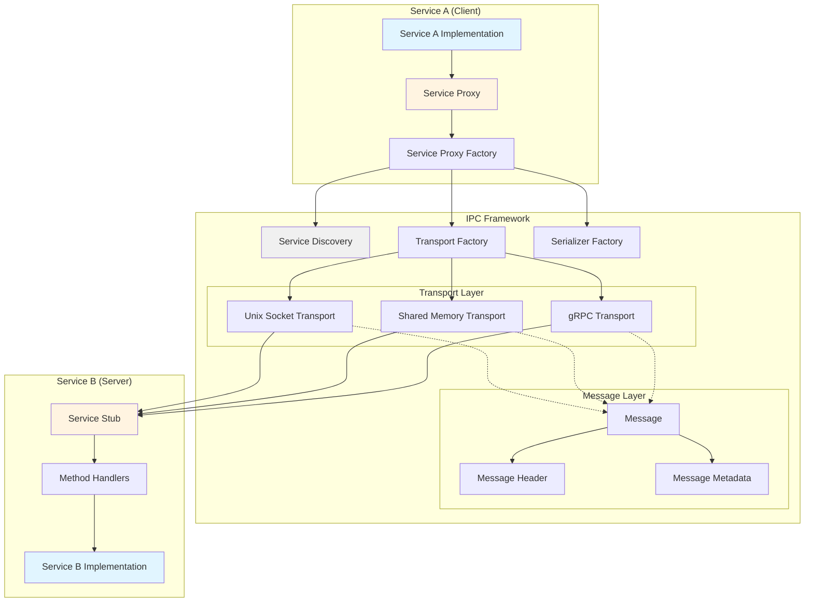
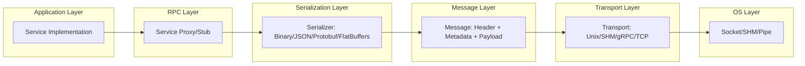
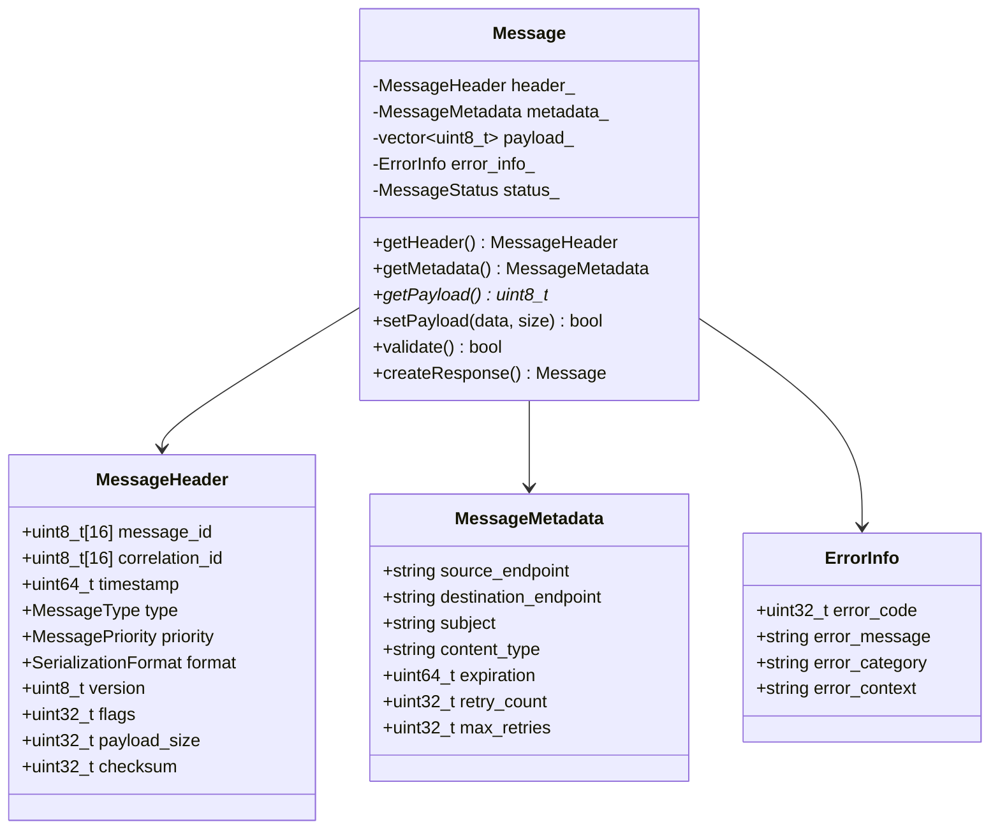
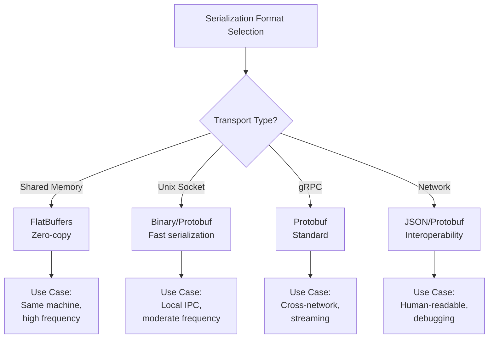
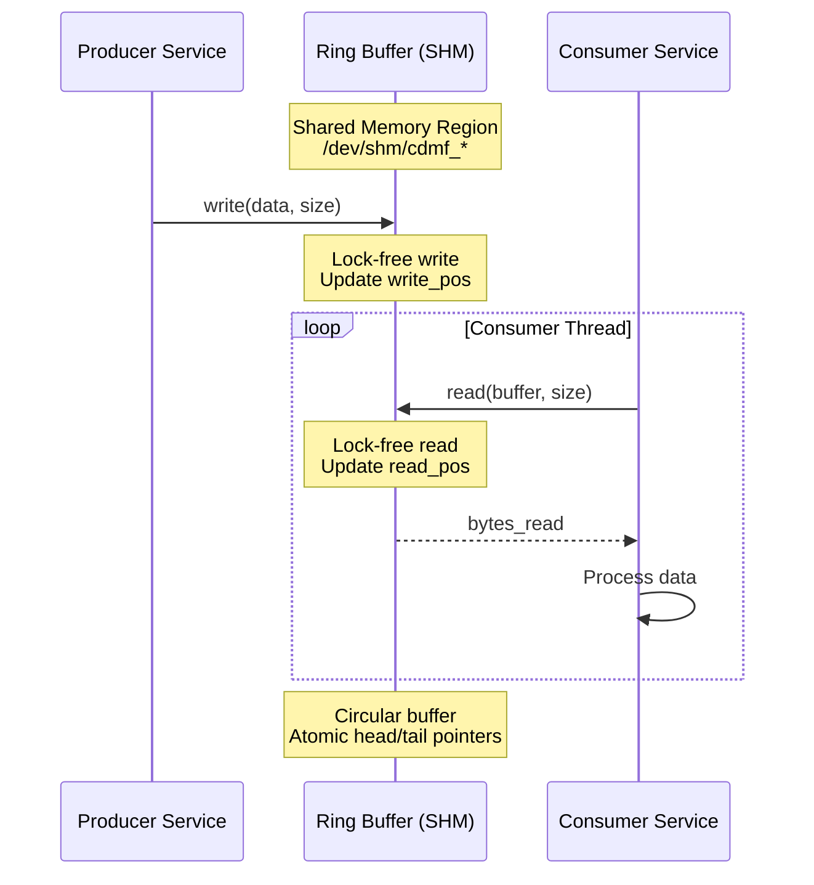
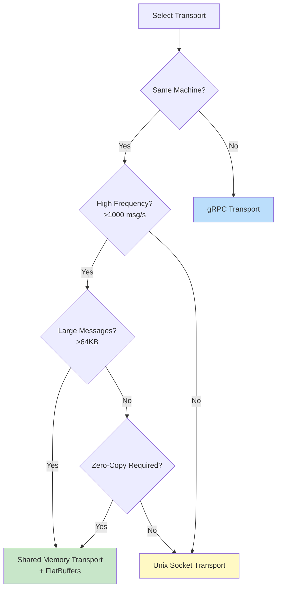
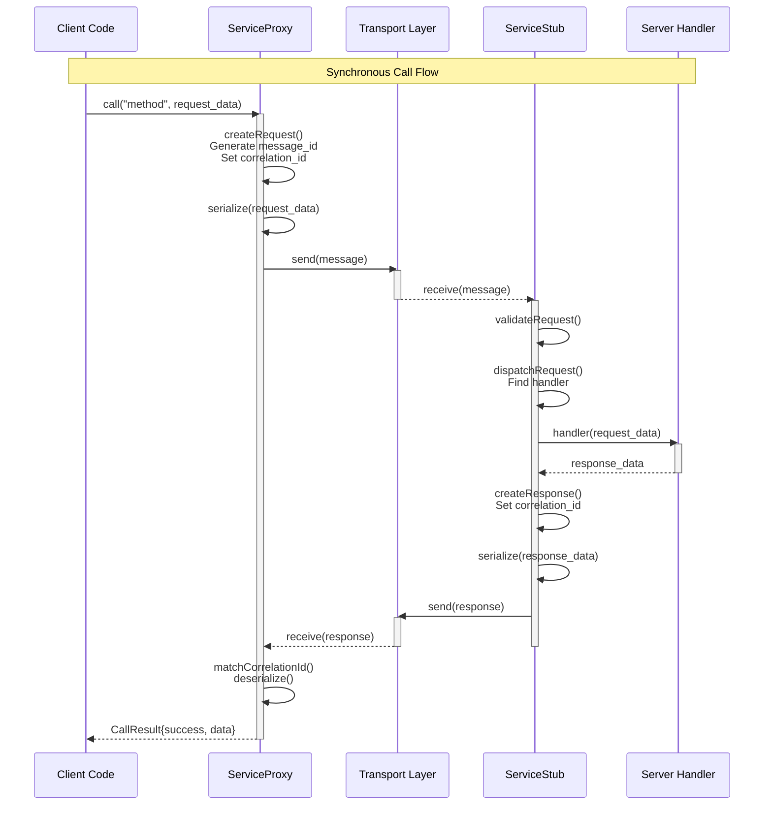
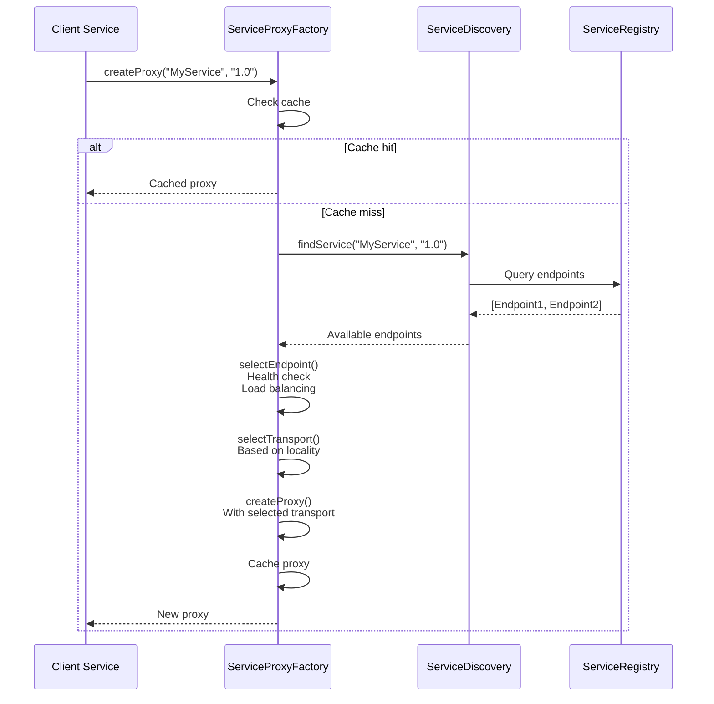
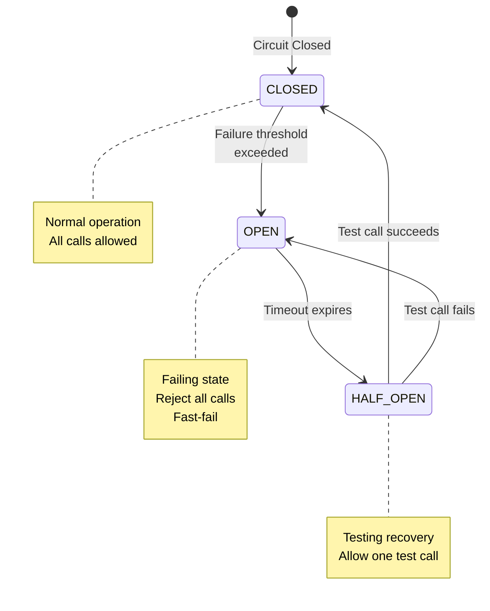
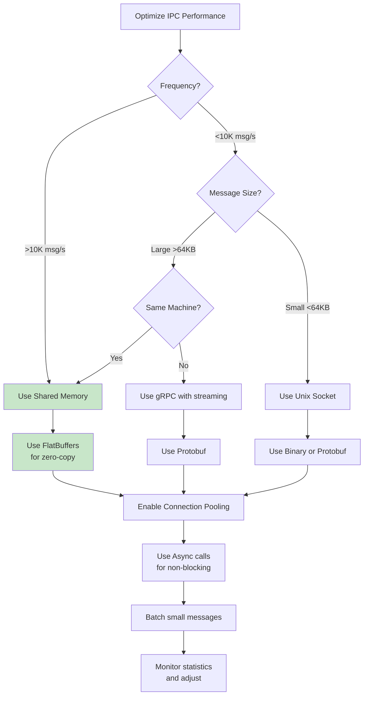

# CDMF IPC Framework Integration Guide

**Version:** 1.0.0
**Date:** 2025-10-05
**Author:** IPC Documentation Team

## Table of Contents

1. [Overview](#overview)
2. [Architecture](#architecture)
3. [Message Layer](#message-layer)
4. [Transport Layer](#transport-layer)
5. [Proxy/Stub Pattern (RPC)](#proxystub-pattern-rpc)
6. [Service Discovery & Factory](#service-discovery--factory)
7. [Service Integration Examples](#service-integration-examples)
8. [Performance Considerations](#performance-considerations)
9. [Best Practices](#best-practices)
10. [API Reference](#api-reference)

---

## Overview

The CDMF IPC (Inter-Process Communication) framework provides a comprehensive, transport-agnostic RPC (Remote Procedure Call) system for service-to-service communication. It supports multiple transport mechanisms, serialization formats, and provides built-in reliability features.

### Key Features

- **Multiple Transport Options**: Unix sockets, shared memory, gRPC, TCP/UDP
- **Flexible Serialization**: Binary, JSON, Protocol Buffers, FlatBuffers, MessagePack
- **RPC Patterns**: Synchronous, asynchronous, one-way calls
- **Reliability**: Retry policies, circuit breakers, health checks, connection pooling
- **Service Discovery**: Automatic endpoint resolution and load balancing
- **Zero-Copy**: FlatBuffers with shared memory for ultra-low latency
- **Thread-Safe**: All components support concurrent access

---

## Architecture

### High-Level Component Architecture



### IPC Stack Layers



---

## Message Layer

### Message Structure

The message is the fundamental unit of IPC communication, containing header, metadata, payload, and error information.



### Message Types

| Type | Description | Response Expected |
|------|-------------|-------------------|
| `REQUEST` | RPC request | Yes |
| `RESPONSE` | RPC response | No |
| `EVENT` | Event notification | No |
| `ERROR` | Error message | No |
| `HEARTBEAT` | Keepalive ping | Optional |
| `CONTROL` | Control message | Optional |

### Serialization Formats



**Performance Comparison:**

| Format | Serialization Speed | Size | Zero-Copy | Human-Readable |
|--------|-------------------|------|-----------|----------------|
| **Binary** | Fastest | Smallest | ❌ | ❌ |
| **FlatBuffers** | Very Fast | Small | ✅ | ❌ |
| **Protobuf** | Fast | Small | ❌ | ❌ |
| **MessagePack** | Fast | Small | ❌ | ❌ |
| **JSON** | Moderate | Large | ❌ | ✅ |

---

## Transport Layer

### Transport Interface

All transport implementations inherit from `ITransport`:

```cpp
class ITransport {
public:
    virtual TransportResult<bool> init(const TransportConfig& config) = 0;
    virtual TransportResult<bool> start() = 0;
    virtual TransportResult<bool> stop() = 0;
    virtual TransportResult<bool> connect() = 0;
    virtual TransportResult<bool> disconnect() = 0;
    virtual bool isConnected() const = 0;

    virtual TransportResult<bool> send(const Message& message) = 0;
    virtual TransportResult<MessagePtr> receive(int32_t timeout_ms = 0) = 0;

    virtual void setMessageCallback(MessageCallback callback) = 0;
    virtual void setErrorCallback(ErrorCallback callback) = 0;
    virtual TransportStats getStats() const = 0;
};
```

### Transport Implementations

#### 1. Unix Domain Socket Transport

**File:** `workspace/src/framework/include/ipc/unix_socket_transport.h`

**Characteristics:**
- **Latency:** Sub-millisecond
- **Throughput:** ~1-5 GB/s
- **Scope:** Same machine only
- **Modes:** Stream (SOCK_STREAM) or Datagram (SOCK_DGRAM)
- **Features:** epoll support, connection pooling

**Use Cases:**
- Service-to-service on same host
- Moderate to high frequency communication
- Reliable ordered delivery required

#### 2. Shared Memory Transport

**File:** `workspace/src/framework/include/ipc/shared_memory_transport.h`

**Characteristics:**
- **Latency:** Microseconds
- **Throughput:** Memory bandwidth (~10-50 GB/s)
- **Scope:** Same machine only
- **Mechanism:** Ring buffer with atomic operations
- **Features:** Zero-copy with FlatBuffers, lock-free reads

**Use Cases:**
- Ultra-low latency requirements
- High-frequency data streaming (e.g., sensor data, video frames)
- Producer-consumer patterns

**Architecture:**



#### 3. gRPC Transport

**File:** `workspace/src/framework/include/ipc/grpc_transport.h`

**Characteristics:**
- **Latency:** Milliseconds
- **Throughput:** Network dependent
- **Scope:** Cross-network
- **Protocol:** HTTP/2
- **Features:** Bidirectional streaming, TLS/SSL, load balancing

**Use Cases:**
- Cross-machine communication
- Microservices architecture
- Bidirectional streaming
- Internet-facing APIs

### Transport Selection Decision Tree



---

## Proxy/Stub Pattern (RPC)

The proxy/stub pattern provides transparent remote method invocation, making remote calls look like local function calls.

### RPC Call Flow



### ServiceProxy API

**Client-Side (Caller)**

```cpp
// Configuration
ProxyConfig config;
config.transport_config.type = TransportType::UNIX_SOCKET;
config.transport_config.endpoint = "/tmp/myservice.sock";
config.default_timeout_ms = 5000;
config.retry_policy.enabled = true;
config.retry_policy.max_attempts = 3;

// Create proxy
auto proxy = std::make_shared<ServiceProxy>(config);
proxy->connect();

// Synchronous call
std::vector<uint8_t> request = serializeRequest(data);
auto result = proxy->call("methodName", request, 1000); // 1s timeout

if (result.success) {
    auto response = deserializeResponse(result.data);
    // Use response
} else {
    LOGE("Call failed: " << result.error_message);
}

// Asynchronous call
auto future = proxy->callAsync("methodName", request);
// Continue work...
auto result = future.get(); // Block when ready

// One-way call (fire-and-forget)
proxy->callOneWay("logEvent", eventData);
```

### ServiceStub API

**Server-Side (Callee)**

```cpp
// Configuration
StubConfig config;
config.service_name = "MyService";
config.transport_config.type = TransportType::UNIX_SOCKET;
config.transport_config.endpoint = "/tmp/myservice.sock";
config.max_concurrent_requests = 100;

// Create stub
auto stub = std::make_shared<ServiceStub>(config);

// Register method handlers
stub->registerMethod("echo", [](const std::vector<uint8_t>& request) {
    return request; // Echo back
});

stub->registerMethod("processData", [this](const std::vector<uint8_t>& request) {
    auto data = deserialize(request);
    auto result = this->process(data);
    return serialize(result);
});

stub->registerMethod("add", [](const std::vector<uint8_t>& request) {
    int32_t a = *reinterpret_cast<const int32_t*>(request.data());
    int32_t b = *reinterpret_cast<const int32_t*>(request.data() + 4);
    int32_t sum = a + b;

    std::vector<uint8_t> response(sizeof(int32_t));
    std::memcpy(response.data(), &sum, sizeof(int32_t));
    return response;
});

// Optional: Set validation
stub->setRequestValidator([](const Message& msg) {
    return msg.getPayloadSize() > 0; // Reject empty payloads
});

// Start stub
stub->start();
```

### Call Types Comparison

```mermaid
graph TD
    subgraph "Synchronous Call"
        SC1[Client: call()] --> SC2[Block]
        SC2 --> SC3[Wait for response]
        SC3 --> SC4[Return result]
    end

    subgraph "Asynchronous Call"
        AC1[Client: callAsync()] --> AC2[Return future]
        AC2 --> AC3[Continue work]
        AC3 --> AC4[future.get()]
        AC4 --> AC5[Block when ready]
    end

    subgraph "One-Way Call"
        OW1[Client: callOneWay()] --> OW2[Send message]
        OW2 --> OW3[Return immediately]
        OW3 --> OW4[No response]
    end

    style SC4 fill:#ffcdd2
    style AC2 fill:#c8e6c9
    style OW3 fill:#fff9c4
```

---

## Service Discovery & Factory

### ServiceProxyFactory

The `ServiceProxyFactory` automates proxy creation with service discovery, transport selection, and health checking.

```mermaid
graph TB
    subgraph "ServiceProxyFactory"
        SPF[Service Proxy Factory]
        Cache[Proxy Cache]
        SD[Service Discovery]
        TS[Transport Selector]
        SS[Serializer Selector]
        HC[Health Checker]
        CB[Circuit Breaker]
    end

    Client[Client Service]

    Client -->|createProxy("ServiceName")| SPF
    SPF --> SD
    SD -->|ServiceEndpoint| TS
    TS -->|Transport| SS
    SS -->|Serializer| SPF
    SPF --> Cache
    SPF --> HC
    SPF --> CB
    SPF -->|ServiceProxy| Client

    style Cache fill:#fff9c4
    style SD fill:#c8e6c9
    style HC fill:#bbdefb
```

### Service Discovery Flow



### Automatic Transport Selection

```cpp
// Factory automatically selects transport based on service location
ServiceProxyFactory factory;
factory.setServiceDiscovery(discoveryService);

// Discovers service, determines if local or remote, selects transport
auto proxy = factory.createProxy("DataProcessor", "1.0");

// If local:  Unix Socket or Shared Memory
// If remote: gRPC
// Factory handles all details transparently
```

### Health Checking & Circuit Breaker



---

## Service Integration Examples

### Example 1: Producer-Consumer with Shared Memory

**Scenario:** High-frequency sensor data from producer to consumer.

**Consumer Service (Server):**

```cpp
// File: workspace/src/modules/sensor_consumer_service/sensor_consumer_service_impl.cpp

class SensorConsumerServiceImpl : public ISensorConsumerService {
public:
    void start() {
        // Create stub with shared memory transport
        StubConfig stubConfig;
        stubConfig.service_name = "SensorConsumer";
        stubConfig.transport_config.type = TransportType::SHARED_MEMORY;
        stubConfig.transport_config.endpoint = "/cdmf_sensor_shm";
        stubConfig.serialization_format = SerializationFormat::FLATBUFFERS;
        stubConfig.max_concurrent_requests = 1000;

        stub_ = std::make_shared<ServiceStub>(stubConfig);

        // Register handlers
        stub_->registerMethod("pushSensorData",
            [this](const std::vector<uint8_t>& data) {
                return this->handleSensorData(data);
            });

        stub_->registerMethod("getStatus",
            [this](const std::vector<uint8_t>&) {
                return this->serializeStatus();
            });

        stub_->start();
        LOGI("SensorConsumerService started with SHM transport");
    }

private:
    std::vector<uint8_t> handleSensorData(const std::vector<uint8_t>& data) {
        // Zero-copy deserialization with FlatBuffers
        auto sensorData = flatbuffers::GetRoot<SensorDataFB>(data.data());

        // Process sensor data
        processSensorReading(
            sensorData->timestamp(),
            sensorData->sensor_id()->str(),
            sensorData->value()
        );

        // Send ACK
        return createAckResponse();
    }

    ServiceStubPtr stub_;
};
```

**Producer Service (Client):**

```cpp
// File: workspace/src/modules/sensor_producer_service/sensor_producer_service_impl.cpp

class SensorProducerServiceImpl : public ISensorProducerService {
public:
    void start() {
        // Create proxy with shared memory transport
        ProxyConfig proxyConfig;
        proxyConfig.service_name = "SensorProducerClient";
        proxyConfig.transport_config.type = TransportType::SHARED_MEMORY;
        proxyConfig.transport_config.endpoint = "/cdmf_sensor_shm";
        proxyConfig.serialization_format = SerializationFormat::FLATBUFFERS;
        proxyConfig.default_timeout_ms = 100; // Low timeout for high frequency

        proxy_ = std::make_shared<ServiceProxy>(proxyConfig);
        proxy_->connect();

        // Start producer thread
        producerThread_ = std::thread(&SensorProducerServiceImpl::producerLoop, this);

        LOGI("SensorProducerService started with SHM transport");
    }

private:
    void producerLoop() {
        while (running_) {
            // Read sensor
            auto sensorData = readSensor();

            // Serialize with FlatBuffers (zero-copy)
            flatbuffers::FlatBufferBuilder builder;
            auto fb = CreateSensorDataFB(builder,
                sensorData.timestamp,
                builder.CreateString(sensorData.sensor_id),
                sensorData.value
            );
            builder.Finish(fb);

            // Send via shared memory (microsecond latency)
            std::vector<uint8_t> data(
                builder.GetBufferPointer(),
                builder.GetBufferPointer() + builder.GetSize()
            );

            auto result = proxy_->callAsync("pushSensorData", data);
            // Don't wait for response, continue producing

            std::this_thread::sleep_for(std::chrono::microseconds(100));
        }
    }

    ServiceProxyPtr proxy_;
    std::thread producerThread_;
};
```

**Performance:**
- Latency: 5-20 microseconds
- Throughput: 50,000+ messages/second
- Zero-copy with FlatBuffers in shared memory

---

### Example 2: Request-Response Service with Unix Sockets

**Scenario:** Calculation service with moderate frequency.

**Server:**

```cpp
class CalculationServiceImpl {
public:
    void start() {
        StubConfig config;
        config.service_name = "CalculationService";
        config.transport_config.type = TransportType::UNIX_SOCKET;
        config.transport_config.endpoint = "/tmp/cdmf_calc.sock";
        config.serialization_format = SerializationFormat::PROTOBUF;

        stub_ = std::make_shared<ServiceStub>(config);

        // Register calculation methods
        stub_->registerMethod("add",
            std::bind(&CalculationServiceImpl::handleAdd, this, std::placeholders::_1));
        stub_->registerMethod("multiply",
            std::bind(&CalculationServiceImpl::handleMultiply, this, std::placeholders::_1));

        stub_->start();
    }

private:
    std::vector<uint8_t> handleAdd(const std::vector<uint8_t>& request) {
        // Deserialize protobuf request
        calc::AddRequest req;
        req.ParseFromArray(request.data(), request.size());

        // Perform calculation
        int32_t result = req.a() + req.b();

        // Serialize protobuf response
        calc::AddResponse resp;
        resp.set_result(result);

        std::vector<uint8_t> response(resp.ByteSizeLong());
        resp.SerializeToArray(response.data(), response.size());
        return response;
    }

    ServiceStubPtr stub_;
};
```

**Client:**

```cpp
class ClientService {
public:
    void start() {
        ProxyConfig config;
        config.transport_config.type = TransportType::UNIX_SOCKET;
        config.transport_config.endpoint = "/tmp/cdmf_calc.sock";
        config.serialization_format = SerializationFormat::PROTOBUF;
        config.default_timeout_ms = 5000;

        proxy_ = std::make_shared<ServiceProxy>(config);
        proxy_->connect();
    }

    int32_t add(int32_t a, int32_t b) {
        // Create protobuf request
        calc::AddRequest req;
        req.set_a(a);
        req.set_b(b);

        std::vector<uint8_t> request(req.ByteSizeLong());
        req.SerializeToArray(request.data(), request.size());

        // Make synchronous call
        auto result = proxy_->call("add", request);

        if (!result.success) {
            throw std::runtime_error("Add call failed: " + result.error_message);
        }

        // Deserialize response
        calc::AddResponse resp;
        resp.ParseFromArray(result.data.data(), result.data.size());

        return resp.result();
    }

private:
    ServiceProxyPtr proxy_;
};
```

---

### Example 3: Using ServiceProxyFactory with Discovery

**Scenario:** Distributed services with automatic discovery.

```cpp
// Server side: Register service
class DataProcessorService {
public:
    void start() {
        // Create and start stub
        StubConfig config;
        config.service_name = "DataProcessor";
        config.transport_config.type = TransportType::GRPC;
        config.transport_config.endpoint = "0.0.0.0:50051";

        stub_ = std::make_shared<ServiceStub>(config);
        stub_->registerMethod("process", /* handler */);
        stub_->start();

        // Register with service discovery
        ServiceEndpoint endpoint;
        endpoint.serviceId = "data_processor_1";
        endpoint.serviceName = "DataProcessor";
        endpoint.version = "1.0.0";
        endpoint.endpoint = "0.0.0.0:50051";
        endpoint.transportType = TransportType::GRPC;
        endpoint.isLocal = false;
        endpoint.isHealthy = true;

        auto metadata = createServiceMetadata();
        serviceDiscovery_->registerService(endpoint, metadata);

        LOGI("DataProcessor registered with service discovery");
    }
};

// Client side: Discover and connect
class ClientService {
public:
    void start() {
        // Configure factory
        ProxyConfig config;
        config.enableRetry = true;
        config.maxRetries = 3;
        config.enableCircuitBreaker = true;
        config.enableHealthCheck = true;

        ServiceProxyFactory factory(config);
        factory.setServiceDiscovery(discoveryService_);

        // Factory automatically:
        // 1. Discovers "DataProcessor" service
        // 2. Selects best endpoint (health, load balancing)
        // 3. Determines transport (gRPC for remote)
        // 4. Creates and configures proxy
        // 5. Caches proxy for reuse
        proxy_ = factory.createProxy("DataProcessor", "1.0.0");

        LOGI("DataProcessor proxy created via factory");
    }

    void processData(const Data& data) {
        auto request = serialize(data);
        auto result = proxy_->call("process", request);

        if (!result.success) {
            // Circuit breaker may have opened
            LOGE("Process call failed: " << result.error_message);
        }
    }

private:
    std::shared_ptr<ServiceProxy> proxy_;
};
```

---

## Performance Considerations

### Latency Comparison

| Transport | Typical Latency | Use Case |
|-----------|----------------|----------|
| **Shared Memory** | 5-20 μs | Ultra-low latency, same machine |
| **Unix Socket** | 50-200 μs | Local IPC, moderate frequency |
| **gRPC (localhost)** | 200-500 μs | Cross-process with features |
| **gRPC (network)** | 1-50 ms | Cross-network, depends on distance |

### Throughput Comparison

| Transport + Serialization | Messages/sec | Bandwidth |
|---------------------------|--------------|-----------|
| SHM + FlatBuffers | 50,000-200,000 | 10-50 GB/s |
| Unix + Binary | 10,000-50,000 | 1-5 GB/s |
| Unix + Protobuf | 5,000-20,000 | 500 MB-2 GB/s |
| gRPC + Protobuf | 1,000-10,000 | 100-500 MB/s |

### Optimization Tips



---

## Best Practices

### 1. Transport Selection

✅ **DO:**
- Use shared memory for high-frequency, same-machine communication
- Use Unix sockets for reliable local IPC with moderate frequency
- Use gRPC for cross-network or when streaming is needed
- Consider message size when selecting transport

❌ **DON'T:**
- Don't use gRPC for local high-frequency calls (overhead)
- Don't use shared memory for cross-machine communication
- Don't use Unix sockets for ultra-low latency requirements

### 2. Serialization

✅ **DO:**
- Use FlatBuffers with shared memory for zero-copy
- Use Protobuf for network communication
- Use Binary for simple, high-performance local IPC
- Use JSON only for debugging or human-readable logs

❌ **DON'T:**
- Don't use JSON for production high-frequency IPC
- Don't mix serialization formats unnecessarily
- Don't serialize large objects in hot paths

### 3. Error Handling

✅ **DO:**
- Always check `CallResult.success` before using data
- Enable retry policies for transient failures
- Use circuit breakers for failing services
- Log errors with context (correlation IDs)
- Set appropriate timeouts

❌ **DON'T:**
- Don't ignore call failures
- Don't retry indefinitely
- Don't use same timeout for all operations
- Don't swallow exceptions in handlers

### 4. Resource Management

✅ **DO:**
- Reuse proxies when possible (use factory caching)
- Close connections gracefully
- Monitor statistics to detect issues
- Set max concurrent requests limits
- Use connection pooling

❌ **DON'T:**
- Don't create new proxy for every call
- Don't leak connections
- Don't ignore resource limits
- Don't block indefinitely

### 5. Thread Safety

✅ **DO:**
- ServiceProxy and ServiceStub are thread-safe
- Use multiple threads for concurrent calls
- Protect shared state in handlers

❌ **DON'T:**
- Don't assume handlers run on specific threads
- Don't share mutable state without synchronization

---

## API Reference

### Core Classes

#### ServiceProxy

**Location:** `workspace/src/framework/include/ipc/service_proxy.h`

**Key Methods:**
```cpp
// Connection
bool connect();
bool disconnect();
bool isConnected() const;

// Synchronous calls
CallResult<std::vector<uint8_t>> call(
    const std::string& method_name,
    const std::vector<uint8_t>& request_data,
    uint32_t timeout_ms = 0);

// Asynchronous calls
std::future<CallResult<std::vector<uint8_t>>> callAsync(
    const std::string& method_name,
    const std::vector<uint8_t>& request_data,
    uint32_t timeout_ms = 0);

// One-way calls
bool callOneWay(
    const std::string& method_name,
    const std::vector<uint8_t>& request_data);

// Configuration
void setRetryPolicy(const RetryPolicy& policy);
void setDefaultTimeout(uint32_t timeout_ms);

// Statistics
ProxyStatsSnapshot getStats() const;
void resetStats();
```

#### ServiceStub

**Location:** `workspace/src/framework/include/ipc/service_stub.h`

**Key Methods:**
```cpp
// Lifecycle
bool start();
bool stop();
bool isRunning() const;

// Method registration
bool registerMethod(const std::string& method_name, MethodHandler handler);
bool unregisterMethod(const std::string& method_name);
bool hasMethod(const std::string& method_name) const;

// Hooks
void setRequestValidator(RequestValidator validator);
void setAuthenticationHandler(AuthenticationHandler handler);

// Configuration
void setMaxConcurrentRequests(uint32_t max_requests);
void setRequestTimeout(uint32_t timeout_ms);

// Statistics
StubStatsSnapshot getStats() const;
void resetStats();
```

#### ServiceProxyFactory

**Location:** `workspace/src/framework/include/ipc/service_proxy_factory.h`

**Key Methods:**
```cpp
// Proxy creation
std::shared_ptr<ServiceProxy> createProxy(
    const std::string& serviceName,
    const std::string& version = "");

std::shared_ptr<ServiceProxy> getCachedProxy(const std::string& serviceId);
void clearCache();

// Service discovery
std::vector<ServiceEndpoint> discoverService(
    const std::string& serviceName,
    const std::string& version = "");

bool checkHealth(const ServiceEndpoint& endpoint);

// Statistics
ProxyFactoryStats getStats() const;
```

---

## Summary

The CDMF IPC framework provides a comprehensive, flexible, and high-performance solution for inter-service communication:

- **Transparent RPC**: Services call remote methods as if they were local
- **Multiple Transports**: Choose optimal transport for your use case
- **High Performance**: Microsecond latency with shared memory + FlatBuffers
- **Reliability**: Built-in retry, circuit breaker, health checking
- **Service Discovery**: Automatic endpoint resolution and load balancing
- **Easy Integration**: Simple API with factory pattern for common cases

**Next Steps:**
1. Review transport selection guide for your use case
2. Implement ServiceStub on server side
3. Create ServiceProxy on client side
4. Configure appropriate serialization format
5. Enable reliability features (retry, circuit breaker)
6. Monitor statistics and tune performance

For more examples, see:
- `workspace/tests/unit/test_proxy_stub.cpp` - Comprehensive RPC tests
- `workspace/src/modules/shm_*_service/` - Shared memory examples
- `workspace/docs/api/` - Detailed API documentation
