# Shared Memory Ring Buffer - Deep Dive

## Table of Contents
- [1. Overview](#1-overview)
- [2. Architecture](#2-architecture)
- [3. SPSC Ring Buffer Mechanics](#3-spsc-ring-buffer-mechanics)
- [4. MPMC Ring Buffer Mechanics](#4-mpmc-ring-buffer-mechanics)
- [5. Shared Memory Layout](#5-shared-memory-layout)
- [6. Complete Message Flow](#6-complete-message-flow)
- [7. Performance Analysis](#7-performance-analysis)
- [8. Configuration Guide](#8-configuration-guide)

---

## 1. Overview

The CDMF framework implements high-performance shared memory IPC using lock-free ring buffers. This achieves **10-20 μs latency** with **10 GB/s throughput** for same-host communication.

### Key Features

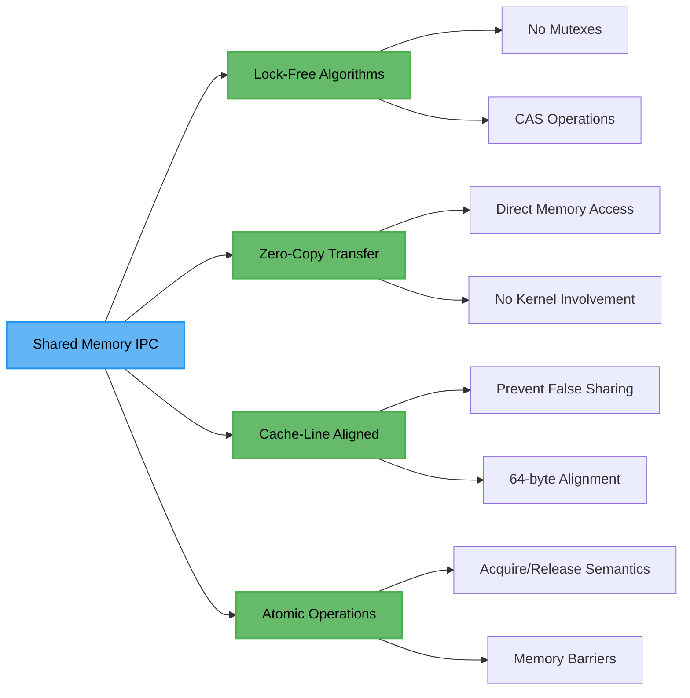

### Transport Comparison

| Transport | Latency | Throughput | Use Case |
|-----------|---------|------------|----------|
| **Shared Memory** | 10-20 μs | 10 GB/s | High-frequency, low-latency |
| Unix Socket | 50-100 μs | 1 GB/s | General-purpose IPC |
| gRPC | 1-10 ms | 100 MB/s | Remote services, secure |

---

## 2. Architecture

### 2.1 Ring Buffer Variants

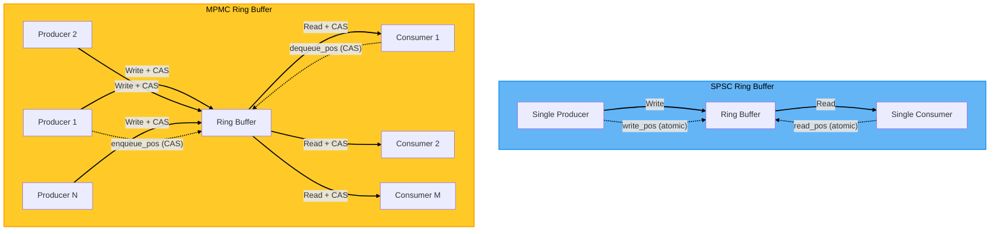

### 2.2 Data Structure Layout

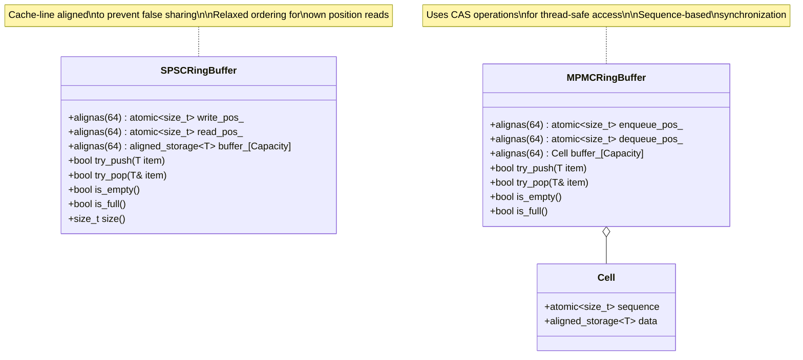

---

## 3. SPSC Ring Buffer Mechanics

### 3.1 Memory Layout

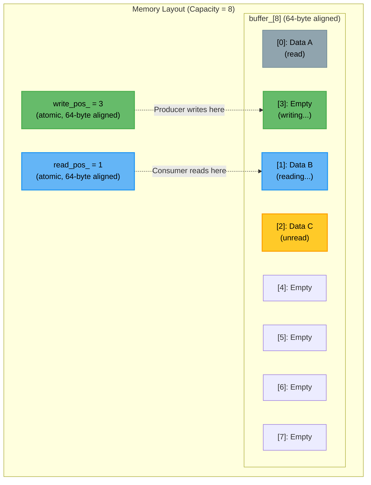

### 3.2 Push Operation Sequence

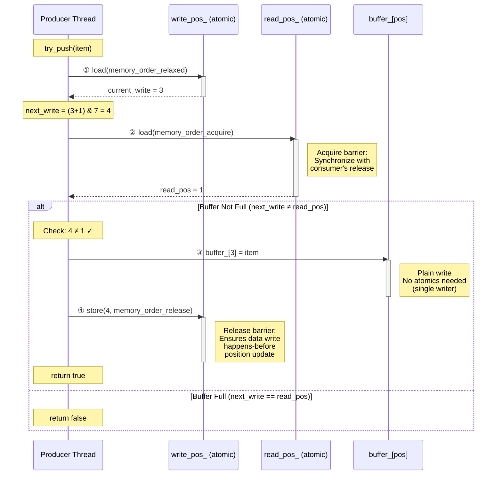

### 3.3 Pop Operation Sequence

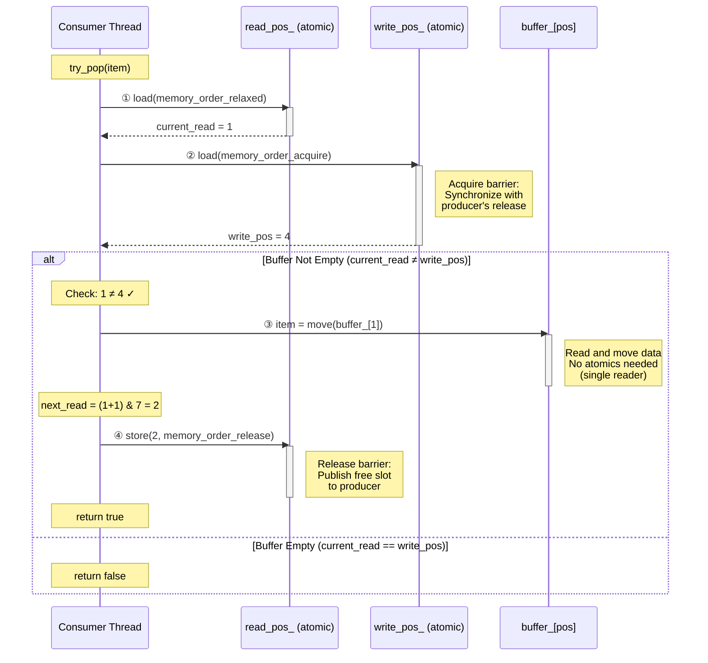

### 3.4 Memory Ordering Guarantees

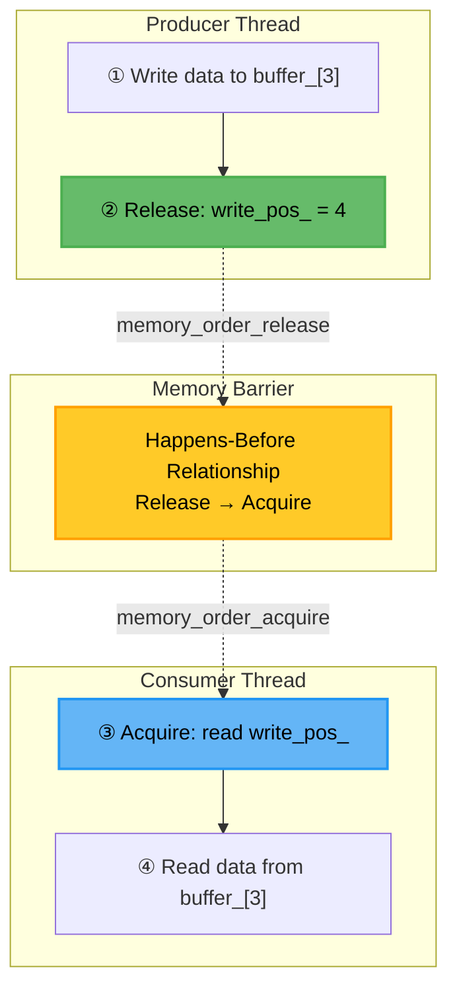

---

## 4. MPMC Ring Buffer Mechanics

### 4.1 Cell Structure with Sequence Numbers

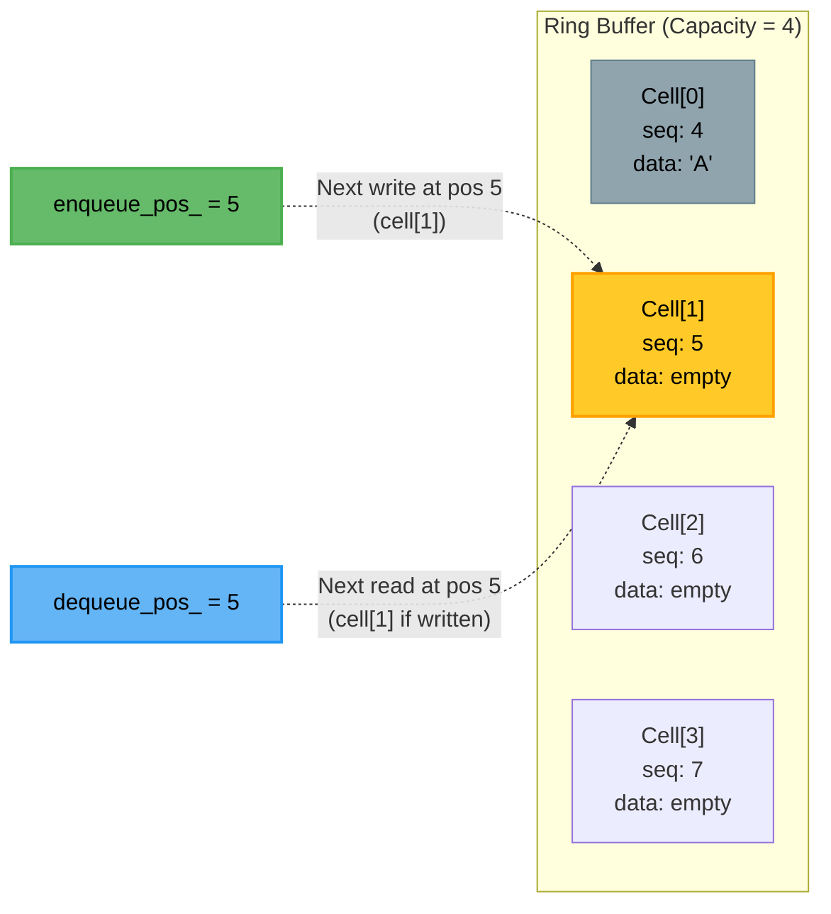

**Sequence Number Interpretation:**
- `seq == pos`: Cell is **empty**, ready for writing at position `pos`
- `seq == pos + 1`: Cell is **full**, ready for reading at position `pos`
- `seq < pos`: Cell is **behind** (consumer hasn't read yet)
- `seq > pos + 1`: Cell is **ahead** (producer already wrote here)

### 4.2 MPMC Push Operation (With Contention)

```mermaid
sequenceDiagram
    participant T1 as Thread 1 (Producer)
    participant T2 as Thread 2 (Producer)
    participant EP as enqueue_pos_ (atomic)
    participant Cell as Cell[pos]

    Note over T1,T2: Both threads try to push

    par Thread 1 Execution
        T1->>EP: ① load(relaxed)
        activate EP
        EP-->>T1: pos = 5
        deactivate EP

        T1->>Cell: ② cell = &buffer_[5 & 3]
        Note over T1: cell = &buffer_[1]

        T1->>Cell: ③ seq = cell->sequence.load(acquire)
        activate Cell
        Cell-->>T1: seq = 5
        deactivate Cell

        Note over T1: dif = seq - pos = 5 - 5 = 0 ✓

        T1->>EP: ④ CAS(5 → 6)
        activate EP
        Note right of EP: compare_exchange_weak:<br/>if (enqueue_pos == 5)<br/>  enqueue_pos = 6;<br/>  return true;
        EP-->>T1: SUCCESS ✓
        deactivate EP

        T1->>Cell: ⑤ Write data to cell->data
        activate Cell
        deactivate Cell

        T1->>Cell: ⑥ cell->sequence.store(6, release)
        activate Cell
        Note right of Cell: Publish to consumers
        deactivate Cell
    end

    par Thread 2 Execution
        T2->>EP: ① load(relaxed)
        activate EP
        EP-->>T2: pos = 5
        deactivate EP

        Note over T2: (same initial position)

        T2->>Cell: ② cell = &buffer_[1]

        T2->>Cell: ③ seq = cell->sequence.load(acquire)
        activate Cell
        Cell-->>T2: seq = 5
        deactivate Cell

        Note over T2: dif = 5 - 5 = 0 ✓

        T2->>EP: ④ CAS(5 → 6)
        activate EP
        Note right of EP: FAIL! Already changed to 6<br/>by Thread 1
        EP-->>T2: FAILURE ✗
        deactivate EP

        Note over T2: Retry...

        T2->>EP: ⑦ load(relaxed)
        activate EP
        EP-->>T2: pos = 6
        deactivate EP

        T2->>Cell: ⑧ cell = &buffer_[2]

        T2->>Cell: ⑨ seq = cell->sequence.load(acquire)
        activate Cell
        Cell-->>T2: seq = 6
        deactivate Cell

        Note over T2: dif = 6 - 6 = 0 ✓

        T2->>EP: ⑩ CAS(6 → 7)
        activate EP
        EP-->>T2: SUCCESS ✓
        deactivate EP

        T2->>Cell: ⑪ Write data to cell[2]
        activate Cell
        deactivate Cell

        T2->>Cell: ⑫ cell->sequence.store(7, release)
        activate Cell
        deactivate Cell
    end
```

### 4.3 MPMC Pop Operation

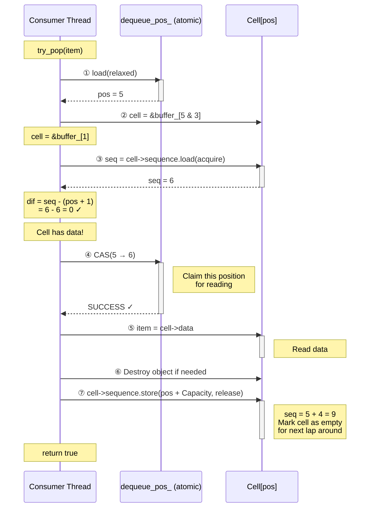

### 4.4 CAS Retry Strategy

```mermaid
flowchart TD
    Start([try_push item]) --> LoadPos[pos = enqueue_pos.load]
    LoadPos --> GetCell[cell = buffer_[pos & mask]]
    GetCell --> LoadSeq[seq = cell->sequence.load acquire]
    LoadSeq --> CalcDiff[dif = seq - pos]

    CalcDiff --> CheckDiff{dif?}

    CheckDiff -->|"= 0<br/>(available)"| CAS[CAS enqueue_pos<br/>pos → pos+1]
    CheckDiff -->|"< 0<br/>(full)"| ReturnFalse[return false<br/>Buffer Full]
    CheckDiff -->|"> 0<br/>(outdated)"| Reload[pos = enqueue_pos.load]

    CAS --> CheckCAS{Success?}
    CheckCAS -->|Yes| WriteData[Write data to cell]
    CheckCAS -->|No<br/>Contention| Backoff[Exponential backoff]

    Backoff --> Reload
    Reload --> GetCell

    WriteData --> UpdateSeq[cell->sequence.store<br/>pos+1, release]
    UpdateSeq --> ReturnTrue[return true]

    style Start fill:#64b5f6,stroke:#2196f3,stroke-width:2px,color:#000
    style CAS fill:#ffca28,stroke:#ffa000,stroke-width:2px,color:#000
    style WriteData fill:#66bb6a,stroke:#4caf50,stroke-width:2px,color:#000
    style ReturnTrue fill:#66bb6a,stroke:#4caf50,stroke-width:2px,color:#000
    style ReturnFalse fill:#ef5350,stroke:#d32f2f,stroke-width:2px,color:#000
```

---

## 5. Shared Memory Layout

### 5.1 Complete Memory Map

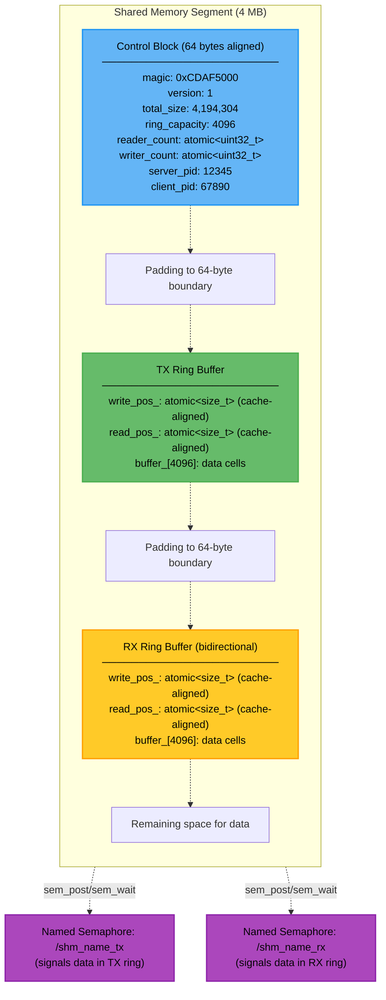

### 5.2 Message Envelope Structure

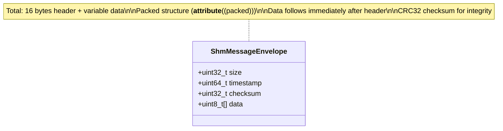

**Byte Layout:**
```
Offset  Size  Field           Description
──────  ────  ──────          ────────────────────────────
0       4     size            Payload size in bytes
4       8     timestamp       Microseconds since Unix epoch
12      4     checksum        CRC32 of payload data
16      N     data            Variable-length payload
```

---

## 6. Complete Message Flow

### 6.1 End-to-End Sending Sequence

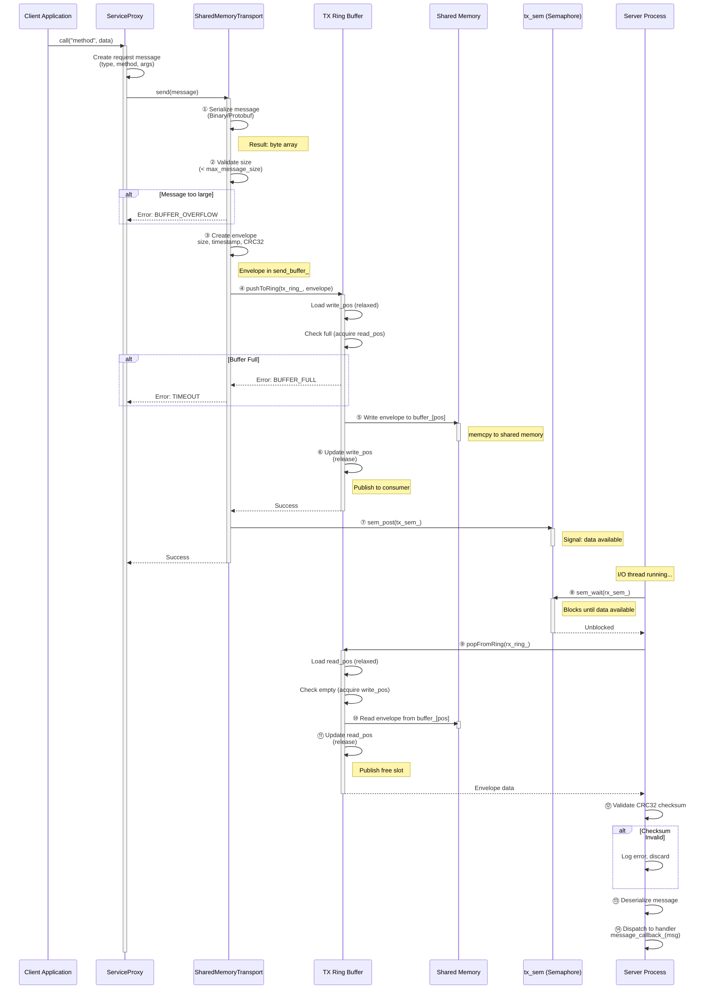

### 6.2 Bidirectional Communication

```mermaid
sequenceDiagram
    participant C as Client Process
    participant TXR as TX Ring Buffer
    participant SHM as Shared Memory
    participant RXR as RX Ring Buffer
    participant S as Server Process

    Note over C,S: Request Flow

    C->>TXR: Write request envelope
    activate TXR
    TXR->>SHM: memcpy to buffer_[write_pos]
    activate SHM
    deactivate SHM
    TXR->>TXR: write_pos++
    deactivate TXR

    C->>C: sem_post(tx_sem)

    S->>S: sem_wait(rx_sem) ← TX becomes RX

    S->>RXR: Read request envelope
    activate RXR
    RXR->>SHM: Read buffer_[read_pos]
    activate SHM
    deactivate SHM
    RXR->>RXR: read_pos++
    deactivate RXR

    S->>S: Process request<br/>Call handler

    Note over C,S: Response Flow

    S->>RXR: Write response envelope
    activate RXR
    Note right of RXR: RX ring becomes TX<br/>for responses
    RXR->>SHM: memcpy to buffer_[write_pos]
    activate SHM
    deactivate SHM
    RXR->>RXR: write_pos++
    deactivate RXR

    S->>S: sem_post(rx_sem)

    C->>C: sem_wait(tx_sem) ← RX becomes TX

    C->>TXR: Read response envelope
    activate TXR
    Note right of TXR: TX ring becomes RX<br/>for responses
    TXR->>SHM: Read buffer_[read_pos]
    activate SHM
    deactivate SHM
    TXR->>TXR: read_pos++
    deactivate TXR

    C->>C: Deserialize response<br/>Return to caller

    style SHM fill:#ffca28,stroke:#ffa000,stroke-width:2px,color:#000
```

---

## 7. Performance Analysis

### 7.1 Latency Breakdown

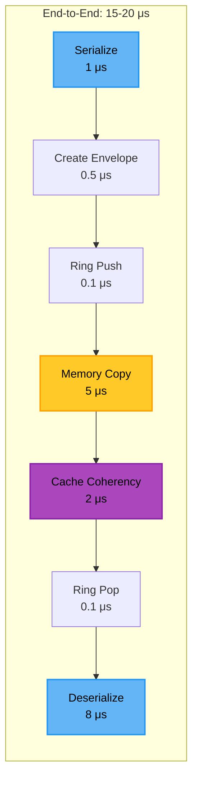

| Operation | SPSC | MPMC | Notes |
|-----------|------|------|-------|
| Atomic CAS | N/A | 0.1 μs | Single CPU instruction |
| Memory copy (1 KB) | 5 μs | 5 μs | memcpy overhead |
| Cache coherency | 2 μs | 2-5 μs | MESI protocol |
| Serialization | 1 μs | 1 μs | Binary format |
| Deserialization | 8 μs | 8 μs | Depends on complexity |
| **Total** | **~15 μs** | **~20 μs** | **10x faster than sockets** |

### 7.2 Throughput Characteristics

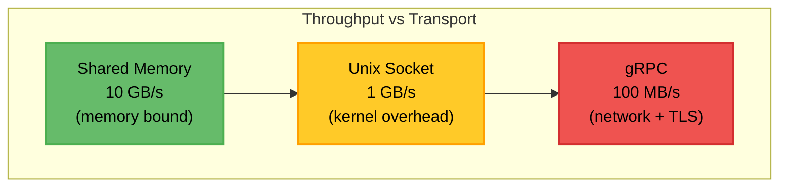

### 7.3 Cache-Line Alignment Impact

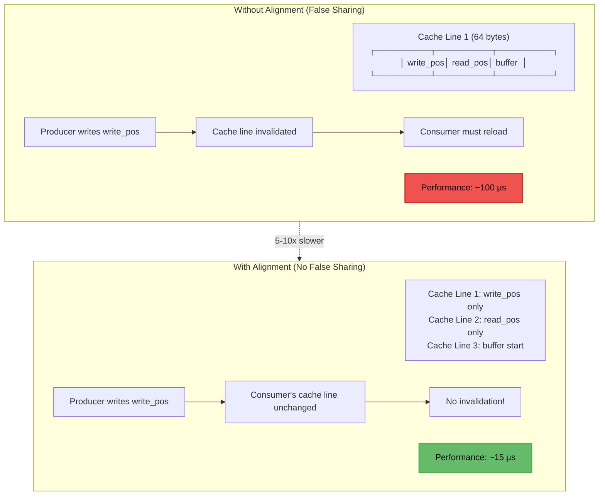

### 7.4 Comparison Matrix

| Feature | Shared Memory | Unix Socket | gRPC |
|---------|---------------|-------------|------|
| **Latency** | 10-20 μs | 50-100 μs | 1-10 ms |
| **Throughput** | 10 GB/s | 1 GB/s | 100 MB/s |
| **Setup Complexity** | Medium | Low | High |
| **Lock-Free** | ✅ Yes | ❌ No | ❌ No |
| **Zero-Copy** | ✅ Yes | ❌ No | ❌ No |
| **Remote Support** | ❌ No | ❌ No | ✅ Yes |
| **Security** | Process isolation | Process isolation | TLS 1.3 |
| **Best For** | High-freq, same-host | General IPC | Cross-network |

---

## 8. Configuration Guide

### 8.1 Buffer Size Selection

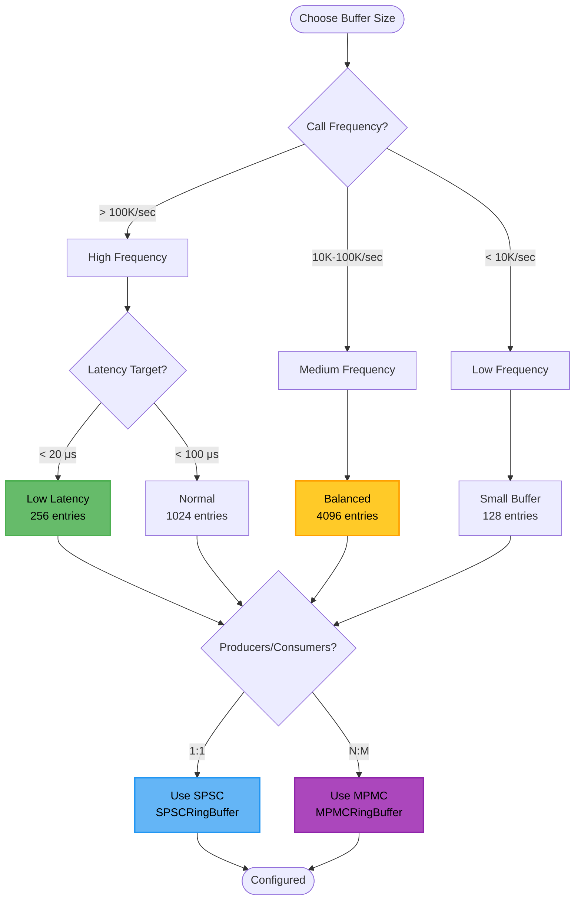

### 8.2 Recommended Configurations

| Scenario | Buffer Size | Ring Type | Message Size | Use Case |
|----------|-------------|-----------|--------------|----------|
| **Ultra Low Latency** | 256 | SPSC | < 4 KB | Trading, telemetry |
| **High Throughput** | 16,384 | SPSC | Variable | Video streaming, bulk data |
| **Balanced** | 4,096 | SPSC | < 64 KB | General-purpose IPC |
| **Multi-Producer** | 8,192 | MPMC | < 16 KB | Work queue, task distribution |
| **Multi-Consumer** | 2,048 | MPMC | < 8 KB | Fan-out processing |

### 8.3 Tuning Parameters

```cpp
// Example: Ultra low-latency configuration
TransportConfig config;
config.endpoint = "/cdmf_shm_lowlat";
config.properties["shm_size"] = "4194304";           // 4 MB
config.properties["ring_buffer_capacity"] = "256";   // Power of 2
config.properties["create_shm"] = "true";            // Server
config.properties["bidirectional"] = "true";         // Two rings
config.properties["max_message_size"] = "4096";      // 4 KB

// Example: High-throughput configuration
config.properties["ring_buffer_capacity"] = "16384"; // Larger buffer
config.properties["max_message_size"] = "65536";     // 64 KB
```

### 8.4 Memory Requirements Calculator

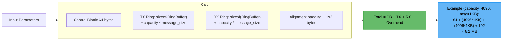

**Formula:**
```
total_size = 64                              // Control block
           + (capacity * message_size) * 2   // TX + RX rings (bidirectional)
           + 192                             // Alignment padding
           + safety_margin(1.2x)             // 20% overhead
```

---

## 9. Debugging and Monitoring

### 9.1 Common Issues

```mermaid
flowchart TD
    Issue([Performance Issue]) --> Diag{Symptom?}

    Diag -->|"High latency"| L1[Check cache alignment]
    Diag -->|"Low throughput"| L2[Check buffer size]
    Diag -->|"Buffer full"| L3[Check consumer speed]
    Diag -->|"CAS contention"| L4[Check producer count]

    L1 --> Fix1["Verify 64-byte alignment<br/>Check for false sharing"]
    L2 --> Fix2["Increase buffer capacity<br/>Use power of 2"]
    L3 --> Fix3["Optimize consumer<br/>Add more consumers"]
    L4 --> Fix4["Reduce producers<br/>Batch messages"]

    style Issue fill:#ef5350,stroke:#d32f2f,stroke-width:2px,color:#000
    style Fix1 fill:#66bb6a,stroke:#4caf50,stroke-width:2px,color:#000
    style Fix2 fill:#66bb6a,stroke:#4caf50,stroke-width:2px,color:#000
    style Fix3 fill:#66bb6a,stroke:#4caf50,stroke-width:2px,color:#000
    style Fix4 fill:#66bb6a,stroke:#4caf50,stroke-width:2px,color:#000
```

### 9.2 Statistics Tracking

```mermaid
classDiagram
    class TransportStats {
        +uint64_t messages_sent
        +uint64_t messages_received
        +uint64_t bytes_sent
        +uint64_t bytes_received
        +uint64_t send_errors
        +uint64_t recv_errors
        +uint32_t active_connections
        +time_point last_error_time
        +string last_error
        +getStats() TransportStats
        +resetStats()
    }

    class RingBufferStats {
        +uint64_t total_pushes
        +uint64_t total_pops
        +uint64_t failed_pushes
        +uint64_t failed_pops
        +uint64_t max_size
        +getUtilization() double
    }

    note for TransportStats "Access via:<br/>transport->getStats()"
    note for RingBufferStats "Calculate:<br/>utilization = max_size / capacity<br/>drop_rate = failed_pushes / total_pushes"
```

---

## 10. Advanced Topics

### 10.1 Memory Barriers Deep Dive

**Acquire-Release Semantics:**

```mermaid
graph TB
    subgraph Producer["Producer Core 0"]
        P1["1. write_local_var = 42"]
        P2["2. buffer_[3] = data"]
        P3["3. write_pos_.store(4, release)"]
    end

    subgraph Barrier["Memory Ordering"]
        B1["All writes before release<br/>must complete first"]
        B2["Synchronization point"]
        B3["All reads after acquire<br/>see previous writes"]
    end

    subgraph Consumer["Consumer Core 1"]
        C1["4. pos = write_pos_.load(acquire)"]
        C2["5. data = buffer_[3]"]
        C3["6. read_local_var"]
    end

    P1 --> P2
    P2 --> P3
    P3 -.->|"release"| B1
    B1 --> B2
    B2 --> B3
    B3 -.->|"acquire"| C1
    C1 --> C2
    C2 --> C3

    style B2 fill:#ffca28,stroke:#ffa000,stroke-width:2px,color:#000
```

### 10.2 Zero-Copy Explained

```mermaid
sequenceDiagram
    participant App as Application
    participant SHM as Shared Memory
    participant Kernel as Kernel
    participant Socket as Unix Socket (comparison)

    Note over App,Socket: Shared Memory (Zero-Copy)

    App->>SHM: ① Write to buffer_[pos]<br/>(direct memory write)
    Note right of SHM: User space<br/>No copy!

    App->>App: ② Update write_pos
    Note right of App: Total copies: 0

    rect rgb(220, 255, 220)
        Note over App,SHM: Consumer reads directly<br/>from same buffer_[pos]
    end

    Note over App,Socket: Unix Socket (Multiple Copies)

    App->>Kernel: ① write() syscall
    Note right of Kernel: Copy 1:<br/>User → Kernel

    Kernel->>Socket: ② Kernel buffer
    Note right of Socket: Copy 2:<br/>Kernel → Socket buffer

    Socket->>Kernel: ③ read() syscall
    Note right of Kernel: Copy 3:<br/>Socket → Kernel

    Kernel->>App: ④ User buffer
    Note right of App: Copy 4:<br/>Kernel → User

    rect rgb(255, 220, 220)
        Note over App,Socket: Total copies: 4<br/>Context switches: 2
    end
```

---

## 11. Implementation Examples

### 11.1 Basic SPSC Usage

```cpp
#include "ipc/ring_buffer.h"

using namespace cdmf::ipc;

// Define message type
struct Message {
    uint64_t id;
    uint32_t type;
    char data[256];
};

// Create ring buffer (capacity must be power of 2)
SPSCRingBuffer<Message, 4096> ring;

// Producer thread
void producer() {
    Message msg;
    msg.id = 12345;
    msg.type = 1;
    strcpy(msg.data, "Hello from producer");

    // Non-blocking push
    if (ring.try_push(msg)) {
        std::cout << "Message sent" << std::endl;
    } else {
        std::cout << "Ring buffer full" << std::endl;
    }
}

// Consumer thread
void consumer() {
    Message msg;

    // Non-blocking pop
    if (ring.try_pop(msg)) {
        std::cout << "Received: " << msg.data << std::endl;
    } else {
        std::cout << "Ring buffer empty" << std::endl;
    }
}
```

### 11.2 Shared Memory Transport Usage

```cpp
#include "ipc/shared_memory_transport.h"

using namespace cdmf::ipc;

// Server setup
void server() {
    TransportConfig config;
    config.endpoint = "/cdmf_shm_example";
    config.properties["shm_size"] = "4194304";           // 4 MB
    config.properties["ring_buffer_capacity"] = "4096";
    config.properties["create_shm"] = "true";            // Server creates
    config.properties["bidirectional"] = "true";

    SharedMemoryTransport transport;
    transport.init(config);
    transport.start();
    transport.connect();

    // Set callback for incoming messages
    transport.setMessageCallback([](MessagePtr msg) {
        std::cout << "Received message, size: " << msg->getPayloadSize() << std::endl;
        // Process message...
    });

    // Transport runs in background thread
    std::this_thread::sleep_for(std::chrono::seconds(60));
}

// Client setup
void client() {
    TransportConfig config;
    config.endpoint = "/cdmf_shm_example";
    config.properties["create_shm"] = "false";  // Client opens existing

    SharedMemoryTransport transport;
    transport.init(config);
    transport.start();
    transport.connect();

    // Send message
    Message msg(MessageType::REQUEST);
    msg.setPayload("Hello", 5);

    auto result = transport.send(msg);
    if (result.success()) {
        std::cout << "Message sent" << std::endl;
    }
}
```

---

## 12. Summary

### Key Takeaways

✅ **Lock-Free Design**: No mutexes, only atomic operations
✅ **Cache-Line Aligned**: Prevents false sharing (64-byte alignment)
✅ **Power-of-2 Sizing**: Fast modulo via bitwise AND
✅ **Memory Ordering**: Acquire/release semantics for correctness
✅ **Zero-Copy**: Direct memory access, no kernel involvement
✅ **Semaphores**: Efficient blocking for async mode

### Performance Benefits

- **10-20 μs latency** (10x faster than Unix sockets)
- **10 GB/s throughput** (memory bandwidth bound)
- **Lock-free scalability** (MPMC scales with cores)
- **CPU cache friendly** (aligned, sequential access)

### When to Use

| Use Shared Memory When: | Use Unix Sockets When: | Use gRPC When: |
|------------------------|------------------------|----------------|
| Same host, high frequency | General IPC, simplicity | Cross-network |
| < 20 μs latency required | Moderate performance OK | Security (TLS) needed |
| Large data transfers | Small messages | Service mesh |
| Deterministic performance | Mixed workloads | Load balancing |

---

## References

- **Source Files:**
  - `workspace/src/framework/include/ipc/ring_buffer.h`
  - `workspace/src/framework/impl/ipc/ring_buffer.cpp`
  - `workspace/src/framework/include/ipc/shared_memory_transport.h`
  - `workspace/src/framework/impl/ipc/shared_memory_transport.cpp`

- **Related Documentation:**
  - IPC Architecture: `workspace/design/diagrams/05_ipc_architecture.puml`
  - Transport Interface: `workspace/src/framework/include/ipc/transport.h`
  - Message Format: `workspace/src/framework/include/ipc/message.h`

- **External References:**
  - Lamport's Lock-Free Queue Algorithm
  - Dmitry Vyukov's MPMC Queue
  - C++ Memory Model (acquire-release)
  - POSIX Shared Memory API
